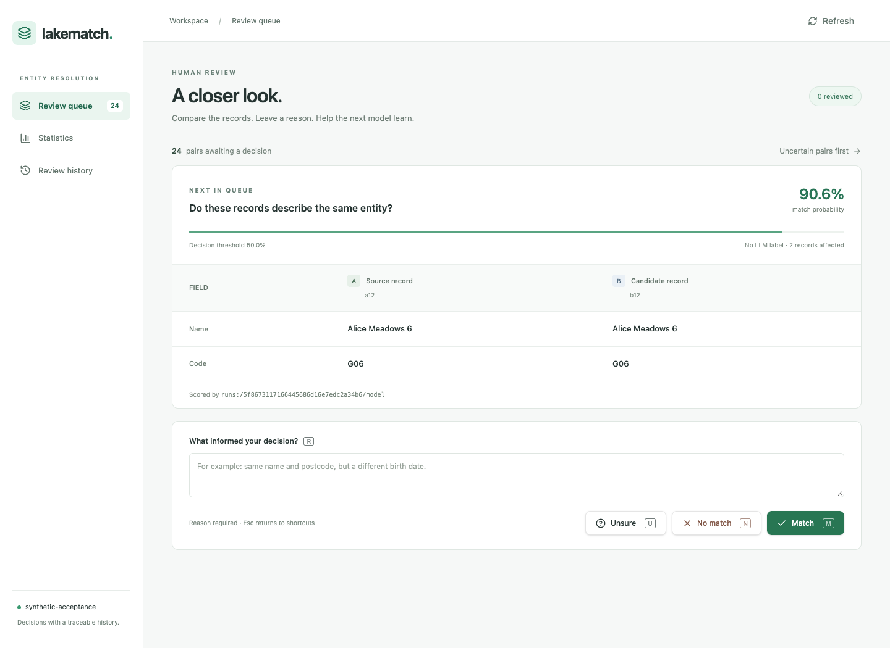

# Lakematch

**Messy records. Meaningful matches.**

The same customer appears twice. A supplier has a different name in finance and
sales. Two product listings look almost identical. Lakematch helps you work out
which records belong together—and gives people a place to review the tricky ones.

Built with Apache Spark and Databricks, Lakematch combines a matching engine,
a browser review app and reproducible experiments. It is a **Solution Accelerator
in development** for customer teams and Solutions Architects building and
demonstrating entity resolution.

[Illustrated guide](reports/lakematch-explained/LakeMatch-Explained.pdf) ·
[Try locally](#try-it-locally) ·
[Review app](app/README.md) ·
[Roadmap](goal_lakefusion.md)

## Put a person behind the decision

Compare records side by side, choose **Match**, **No match** or **Unsure**, and
leave a reason. The app keeps the reviewer, time and model version with each
decision. Resolved reviews can become labels for the next training run.



*The actual review app, captured during the September 2026 synthetic demo.
The score shown belongs to this example pair; it is not an overall accuracy claim.*

## From source records to useful matches

1. **Prepare.** Describe your fields, check data quality and set aside invalid rows.
2. **Shortlist.** Find plausible candidate pairs within explicit limits on work
   and memory, so every record does not need to be compared with every other one.
3. **Compare.** Score similarities in names, addresses, identifiers and other
   fields, then apply the configured matching policy.
4. **Review and improve.** Queue selected pairs for people to inspect, export
   their decisions and retrain through the normal engine workflow.

The engine runs locally with PySpark and has tested Databricks serverless paths.
MLflow records models and evaluations. A standalone Genie space lets you ask
questions about the demo's source records and matching results.

The new company/supplier pilot also has versioned domain definitions, source
mappings and approved candidate-job configurations in PostgreSQL. This is an
engineering foundation; its customer-facing app workflows are still being built.

Want to see what a golden record looks like? The app's **Golden records** tab
has a six-company synthetic preview. Open a field to see where its value came
from, then switch publications to inspect an earlier address or name.
[Explore the screenshots and local setup](reports/lakefusion-ui-20260922-final/README.md).

## Try it locally

Start with the tiny synthetic fixture included in the repository. You need
**Python 3.12**, **Java 17** and [uv](https://docs.astral.sh/uv/). Make sure
`JAVA_HOME` points to Java 17, then run these commands from your checkout:

```bash
uv venv --python 3.12
uv pip install -e '.[dev,connect]'
source .venv/bin/activate
export SPARK_LOCAL_IP=127.0.0.1

lakematch doctor --config examples/synthetic.yaml
lakematch run --config examples/synthetic.yaml --save-scores
```

This trains a small local model and writes links, candidate scores, quarantined
rows and a metrics report under `data/synthetic/output/`. It uses the bundled
CSV files and needs no Databricks credentials or AI endpoint. The example is a
walkthrough, not a measurement of performance on your data.

For the browser experience, follow the [review app setup](app/README.md) and
[synthetic demo flow](app/acceptance/README.md). A new app starts with an empty
queue; the demo flow prepares records and scores for review.

For Databricks, use the [deployment runbook](deployment/README.md). It covers the
jobs, pipeline, app and Genie bundles, including data recovery. It currently
recreates the existing demo environment; a general customer installer is still
on the roadmap.

## What is ready, and what comes next

**Today:** batch matching, quality checks, model tracking, human review and
exporting reviewed labels are implemented and tested. The company pilot has
bounded candidate retrieval and a durable registry for approved definitions.
Its internal worker also allocates persistent company IDs, resolves older aliases
and records repeatable merge/split operations. It can choose trusted field values
and preserve their source records, rules and review decisions in versioned snapshots.
The deployed review store currently requires one app worker and one instance.

**Preview:** a golden-record screen explains selected values, source alternatives
and approved edits across two synthetic publications. Its packaged desktop/mobile
acceptance passes. A separate calibrated model now produces repeatable synthetic
match suggestions; live data and score integration remain ahead.

**Next:** shared steward tasks, governed approvals and recoverable changes. The pilot uses synthetic ERP
vendors and CRM accounts, with each master representing a legal company.

**Later:** incremental updates, online resolution, business relationships,
graph exploration and product information management. Planned AI assistance
uses Unity Gateway; AI adjudication and enrichment are not released features.

Progress and acceptance criteria live in the [delivery roadmap](goal_lakefusion.md).
The accelerator is not yet qualified as a complete production MDM system.

## Results you can inspect

| What we checked | What the evidence shows |
|---|---|
| Reproducibility | Eight frozen benchmark cases replayed with identical scores and decisions. [Test session](reports/test-runs/20260921T092956Z/README.md). |
| Matching quality | F1, which balances missed and incorrect matches, ranges from **26.39% to 98.89%** across the tested tasks. Results depend strongly on the dataset. [Measurements and evaluation scope](bench/BENCHMARKS.md). |
| Company candidate coverage | The selected method retrieves **3,800 of 4,000 known matches (95%)** on synthetic validation data. It misses all 200 cases with combined errors; a larger lexical shortlist recovers them at 22.2× as many pairs. [Comparison](bench/lakefusion/PHASE_B.md). |
| Calibrated company suggestions | **3,400 proposed matches from 4,000 companies**, with zero observed incorrect accepts on synthetic validation. The selection-adjusted family-audit precision lower bound is **99.75%**. Every score and metric replays exactly; confirmation is untouched and automatic merging is disabled. [Results and limits](reports/lakefusion-calibration-20260922/README.md). |
| Registry reliability | **93 checks passed**, including 18 PostgreSQL integration cases covering concurrent changes, rollback and restart persistence. [Registry evidence](bench/lakefusion/registry-20260922.json). |
| Persistent identity | IDs stay stable as records are added; merge/split receipts and older aliases survive retries and database restarts. [Identity evidence](bench/lakefusion/identity-20260922-final.json). |
| Choosing trusted values | Six synthetic company records reproduce the same field choices after a database restart. Overrides, conflicting values and deleted sources have explicit rules. [Scalar policy evidence](bench/lakefusion/survivorship-20260922.json). |
| Explaining earlier records | Two versions retain 48 field explanations each. Local and Delta snapshots agree; earlier values remain explainable after updates, deletions and reviewed changes. [Provenance evidence](bench/lakefusion/PHASE_B.md). |

Candidate coverage measures which pairs reach scoring, not whether they should
be merged. The local scale ladder reached 100,000 records; the million-record
attempt exhausted its fixed heap. See the [scale report](bench/SCALE.md) for the
workload and limits.

## Find your way around

| Start here | For |
|---|---|
| [Illustrated guide](reports/lakematch-explained/LakeMatch-Explained.pdf) | A nontechnical introduction to the tested matching and review demo |
| [Company pilot](examples/mastering/company_pilot/README.md) | Synthetic ERP/CRM records and mapping examples |
| [Review app](app/README.md) | Local setup, keyboard shortcuts and storage options |
| [Deployment](deployment/README.md) | Workspace setup, redeployment and recovery |
| [Engine](src/lakematch/) / [tests](tests/) | Matching code and executable checks |
| [Roadmap](goal_lakefusion.md) | Planned capabilities, current status and acceptance gates |

For development, run `pytest` for local Spark or `python tools/connect_tests.py`
for Spark Connect. Install local commit checks with `python tools/install_hooks.py`.
Use `python tools/scan_source.py` for a static scan that excludes generated
datasets and model copies and writes a fresh report. Models, downloaded corpora
and runtime outputs stay out of Git.

## License

The engine is licensed under [Apache-2.0](LICENSE). The optional APX review app
and DQX integration have separate Databricks license terms; see the
[app notices](app/NOTICE) and [APX license](app/APX-LICENSE.txt).
