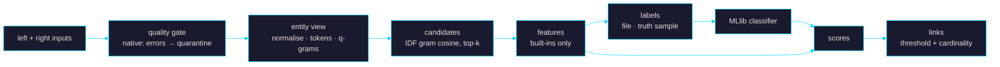

# lakematch

*An entity-resolution engine for the lakehouse: one PySpark codebase for a laptop, Databricks serverless and
classic compute. Apache-2.0. Public repository; no PyPI release.*

 
 


## Contents

- [What / why](#what--why) · [State](#state) · [Quick start](#quick-start) · [How it works](#how-it-works)
- [Configuration](#configuration) · [Tests](#tests) · [What is here](#what-is-here) · [License](#license)

---

## What / why

Matching, linking and mastering records with Spark SQL built-ins only (no JVM code, no UDF on a default path), inside
Spark Declarative Pipelines where the platform allows it, tracked in MLflow, with a human arbitration app (APX) and a
Genie agent. The full specification, the nine bounded phases ZR-1..9 and the ledger of the 28 design decisions are in
[`spec/BRIEF.md`](spec/BRIEF.md).

## State

| Phase | What | State |
|---|---|---|
| ZR-1 | package, config, laptop engine, native quality gate | built 2026-09-26 — judge `goals/verify_zr.sh 1` |
| ZR-2 … ZR-9 | similarity library, benchmarks, clusters, MLflow, serverless, app, Genie, classic | not started |

On FEBRL4 with half the partners removed (5 000 left, 2 500 right, 2 500 true links), the default config gives
F1 0.9996 (held-out left records 0.9996) against 0.667 for "always link the nearest neighbour", with candidate
recall 1.000, in about 27 s including Spark start-up. It gives the same result over Spark Connect and with the network
off. These are single-run figures; the benchmark table with intervals is ZR-3.

---

## Quick start

```bash
uv venv .venv --python 3.12 && uv pip install --python .venv/bin/python -e ".[dev]"
source scripts/env.sh                          # Java 17 (Spark 4.1 dies on Java 23+), loopback only, the venv
python bench/prepare_febrl4.py                 # offline: FEBRL4 ships inside recordlinkage
lakematch doctor --config examples/febrl4.yaml # what the config would do on this machine
lakematch run --config examples/febrl4.yaml    # add --connect to run over a local Spark Connect server
```

`run` writes `data/runs/febrl4/links/` (Parquet: `l_id`, `r_id`, `p`), `quarantine/<side>/` when the quality gate
rejected rows, and `run_summary.json` (counts, threshold, metrics against the truth file, timings).

## How it works


```mermaid
%%{init: {'theme': 'base', 'themeVariables': {'primaryColor': '#1a1a2e', 'primaryTextColor': '#e0e0e0', 'primaryBorderColor': '#00d4ff', 'lineColor': '#00d4ff', 'secondaryColor': '#16213e', 'tertiaryColor': '#0f3460', 'fontFamily': 'monospace'}}}%%
flowchart LR
  in["left + right inputs"] --> dq["quality gate<br/>native: errors → quarantine"]
  dq --> ent["entity view<br/>normalise · tokens · q-grams"]
  ent --> cand["candidates<br/>IDF gram cosine, top-k"]
  cand --> feat["features<br/>built-ins only"]
  feat --> lab["labels<br/>file · truth sample"]
  lab --> train["MLlib classifier"]
  train --> score["scores"]
  feat --> score
  score --> links["links<br/>threshold + cardinality"]
```

Every step up to scoring is a lazy DataFrame transformation; `fit`, threshold selection and the metrics are actions
(job tasks on Databricks, ZR-6). `lakematch.runtime` is the only module that knows which kind of session it runs on;
`materialize()` pins a reused plan with `localCheckpoint()`, `cache()` or a scratch table, whichever the session allows.

## Configuration

One YAML; [`examples/febrl4.yaml`](examples/febrl4.yaml) shows every choice. Every method of the brief is a legal
value today; a choice whose phase has not landed fails with a message naming that phase.

<details><summary>Method choices and what is implemented</summary>

| Key | Choices | Implemented in ZR-1 |
|---|---|---|
| `candidates.method` | gram_topk · learned_blocker · minhash_lsh · field_blocks · union | gram_topk |
| `features.string_similarity` | levenshtein · jaro_winkler · both | levenshtein |
| `features.multi_token` | idf_token_cosine · gram_overlap · monge_elkan_token · affine_gap_udf | the three built-ins |
| `features.embeddings.provider` | auto · none · local · databricks_endpoint | auto (skips with a warning) · none |
| `matcher.estimator` | gbt · logistic_regression · random_forest | all three |
| `decision.cardinality` | one_to_one · many_to_one · unrestricted | all three |
| `cluster.method` | verified_merge · connected_components · center · star | ZR-4 |
| `quality.engine` | native · dqx · expectations | native |
| `labels.source` | file · truth_sample · app | file · truth_sample |
| `runtime.mode` | local (± `connect`) · serverless · classic | local, local + connect |

</details>

> **Paid features.** Everything that bills on top of plain compute has a switch under `paid_features:`. The `laptop`
> profile refuses any of them turned on; the `databricks` profile turns on `app` and `genie` only (D19).

---

## Tests

```bash
scripts/test.sh     # the suite twice: a classic session, then a local Spark Connect server
```

The Connect pass behaves like serverless (no SparkContext, analysis at execution), so a construct that only works in
one fails on the laptop. `tests/test_portability.py` is the lint: no `sparkContext`, `_jvm`, `.rdd`, `udf.register`,
global temp views, `cache` / `persist` / `checkpoint` or Python UDF outside `runtime.py`. `scripts/offline.sb` is the
macOS sandbox profile the judge uses to prove a run needs no network.

## What is here

```text
lakematch/
├── LICENSE                  Apache-2.0
├── pyproject.toml           mandatory deps: pyspark, mlflow, pyyaml; extras: connect, embeddings, dqx, bench, dev
├── src/lakematch/
│   ├── config.py            defaults, profiles, method registry, validation, paid-features guard
│   ├── runtime.py           session factory, is_remote, capability probe, materialize
│   ├── quality/native.py    row and dataset checks, error / warn, apply_and_split
│   ├── entity.py · candidates.py · features/ · labels/ · matcher.py · decision.py · evaluate.py
│   ├── pipeline.py          lakematch run
│   └── cli.py               run · doctor · (train, bench: later phases)
├── examples/febrl4.yaml     the laptop example
├── bench/prepare_febrl4.py  FEBRL4 with half the partners removed
├── scripts/                 env.sh · test.sh · offline.sb
├── tests/                   run twice: classic session and Spark Connect
├── spec/                    BRIEF.md, decisions board, research, porting study, the 2026-09-19 measurement harness
└── tools/spark43_watch.py   weekly check for the Spark 4.3 release (Jaro-Winkler becomes a built-in)
```

Not here, on purpose:

- **Zingg code**: the Spark 4.1 port and its patch live in the public fork `github.com/laurentfabre/zingg` (AGPL v3).
  AGPL code cannot be mixed into this Apache-2.0 repository; reading it is fine, copying it is not.
- Every personal dataset. Only public or synthetic corpora are used, here and on any workspace.
- The corpora themselves (`data/`, `spec/bench/data/`): the loaders fetch or regenerate them.

<details><summary>Resuming on another machine</summary>

1. Java 17, Python 3.12, the quick start above. Spark 4.1 crashes on Java 23+: `scripts/env.sh` pins a 17 or 21.
2. Databricks CLI profiles are per machine. Serverless phases name `fourth-pat` (Free Edition); on this machine either
   create that profile or change the name in the brief and the config. **Classic phases (ZR-9) need `classic.profile`
   set by hand to the paid workspace** — it is never guessed.
3. The LLM labeller is optional and off by default; its key is read from the environment, never from the repository.
4. Stop the warehouse and terminate the cluster the moment a run ends.

</details>

---

## License

Apache-2.0 — see [`LICENSE`](LICENSE). The arbitration app (`app/`, APX) and the DQX adapter rely on components under
the Databricks licence; they are optional and never dependencies of the engine. Prior art credited: Zingg, Splink, the
Magellan group, SecondString, Fellegi and Sunter.
