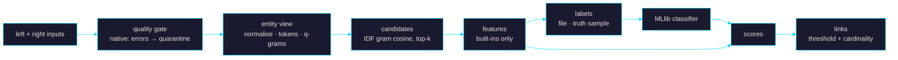

# lakematch

*An entity-resolution engine for the lakehouse: one PySpark codebase for a laptop, Databricks serverless and
classic compute. Apache-2.0. Public repository; no PyPI release.*

 
 


## Contents

- [What / why](#what--why) · [State](#state) · [Quick start](#quick-start) · [How it works](#how-it-works)
- [Configuration](#configuration) · [Tests](#tests) · [What is here](#what-is-here) · [License](#license)

---

## What / why

Matching, linking and mastering records with Spark SQL built-ins only (no JVM code, no UDF on a default path), inside
Spark Declarative Pipelines where the platform allows it, tracked in MLflow, with a human arbitration app (APX) and a
Genie agent. The full specification, the nine bounded phases ZR-1..9 and the ledger of the 28 design decisions are in
[`spec/BRIEF.md`](spec/BRIEF.md).

## State

| Phase | What | State |
|---|---|---|
| ZR-1 | package, config, laptop engine, native quality gate | built 2026-09-26 — judge `goals/verify_zr.sh 1` |
| ZR-2 | similarity library: a feature family per field type, optional UDF features, local embeddings, ablation | built 2026-09-26 — `goals/verify_zr.sh 2`, [`bench/ABLATION.md`](bench/ABLATION.md) |
| ZR-3a | the four other candidate methods; every method choice compared on validation data, winners = defaults | built 2026-09-26 — `goals/verify_zr.sh 3a`, [`bench/METHODS.md`](bench/METHODS.md) |
| ZR-3 | the benchmark harness: 11 corpora end to end, intervals, baselines, Zingg / Splink / published references, Jev cost | built 2026-09-29 — `goals/verify_zr.sh 3`, [`bench/BENCHMARKS.md`](bench/BENCHMARKS.md) |
| ZR-3s | scale-safe candidates: union(gram_topk, field_blocks) re-decided at 10^6 records | built 2026-10-01 — `goals/verify_zr.sh 3s` |
| ZR-4 | clusters (verified merge) and stable identity: mdm_id, crosswalk, merge/split log | built 2026-10-01 — `goals/verify_zr.sh 4`, [`bench/CLUSTERS.md`](bench/CLUSTERS.md) |
| ZR-5 | MLflow: one composite model per run, datasets, evaluation; run id locally, Unity Catalog `@champion` on Databricks | built 2026-10-02 — `goals/verify_zr.sh 5`, [`bench/results/mlflow.json`](bench/results/mlflow.json) |
| ZR-6 … ZR-9 | serverless, app, Genie, classic | not started |

On FEBRL4 with half the partners removed (5 000 left, 2 500 right, 2 500 true links), the default config gives
F1 0.9996 (held-out left records 0.9996) against 0.667 for "always link the nearest neighbour", with candidate
recall 1.000, in about 27 s including Spark start-up. It gives the same result over Spark Connect and with the network
off. [`bench/BENCHMARKS.md`](bench/BENCHMARKS.md) has the full table: every corpus on held-out TEST data with 95 %
bootstrap intervals, the nearest-neighbour baseline, candidate recall, wall time, Jev-only labelling and its cost,
next to Zingg, a measured Splink run and the published figures (`lakematch bench --all`).

---

## Quick start

```bash
uv venv .venv --python 3.12 && uv pip install --python .venv/bin/python -e ".[dev]"
source scripts/env.sh                          # Java 17 (Spark 4.1 dies on Java 23+), loopback only, the venv
python bench/prepare_febrl4.py                 # offline: FEBRL4 ships inside recordlinkage
lakematch doctor --config examples/febrl4.yaml # what the config would do on this machine
lakematch run --config examples/febrl4.yaml    # add --connect to run over a local Spark Connect server
```

`run` writes `data/runs/febrl4/links/` (Parquet: `l_id`, `r_id`, `p`), `quarantine/<side>/` when the quality gate
rejected rows, and `run_summary.json` (counts, threshold, metrics against the truth file, timings).

Every run also logs one MLflow model (below). `--root` redirects every output, the model store included, so a scratch
run never becomes the accepted model.

## The model (MLflow)

A run logs **one composite pyfunc** ([`model_code.py`](src/lakematch/model_code.py), models-from-code) whose artifacts
are the whole bundle: the fitted Spark pipeline, the run's config (feature and candidate spec), the label-set digest
(sha256 of the sorted labelled pairs) and the thresholds. Its signature is pair-level: `l_id`, `r_id` and the
comparison vector in; `l_id`, `r_id`, `p`, `above_threshold` out. The run also logs every method choice as a param,
both inputs, the training and validation labels as `mlflow.data` datasets, and an `mlflow.models.evaluate` pass over
the scored candidate pairs with custom pairwise metrics (precision, recall over *every* true pair, F1, candidate
recall). Before a run is accepted, the logged model is reloaded from the store and must reproduce the run's own
validation scores exactly; it must also fit under `matcher.max_model_mb` and, when set, reach `mlflow.accept_min_f1`.

| | Laptop ([`examples/febrl4.yaml`](examples/febrl4.yaml)) | Databricks ([`examples/febrl4_uc.yaml`](examples/febrl4_uc.yaml)) |
|---|---|---|
| tracking | SQLite, `mlflow.db` next to the repository | `databricks://fourth-pat`, experiment `/Shared/lakematch` |
| registry | none (D17) | Unity Catalog: `workspace.lakematch.lakematch_person` |
| accepted run | its id goes to `models/current.json` | a new version is registered and `@champion` moves to it |
| scoring loads | `runs:/<id>/model` | the version `@champion` names, by its immutable version URI |

The logging code is the same for both; `tracking.register()` is the only registry-specific function, and
`tracking.load_current(cfg)` is what scoring calls. `python bench/mlflow_evidence.py` re-reads both stores and writes
[`bench/results/mlflow.json`](bench/results/mlflow.json): the same label set, and identical scores from the laptop model
and the UC model.

## How it works


```mermaid
%%{init: {'theme': 'base', 'themeVariables': {'primaryColor': '#1a1a2e', 'primaryTextColor': '#e0e0e0', 'primaryBorderColor': '#00d4ff', 'lineColor': '#00d4ff', 'secondaryColor': '#16213e', 'tertiaryColor': '#0f3460', 'fontFamily': 'monospace'}}}%%
flowchart LR
  in["left + right inputs"] --> dq["quality gate<br/>native: errors → quarantine"]
  dq --> ent["entity view<br/>normalise · tokens · q-grams"]
  ent --> cand["candidates<br/>IDF gram cosine, top-k"]
  cand --> feat["features<br/>built-ins only"]
  feat --> lab["labels<br/>file · truth sample"]
  lab --> train["MLlib classifier"]
  train --> score["scores"]
  feat --> score
  score --> links["links<br/>threshold + cardinality"]
```

Every step up to scoring is a lazy DataFrame transformation; `fit`, threshold selection and the metrics are actions
(job tasks on Databricks, ZR-6). `lakematch.runtime` is the only module that knows which kind of session it runs on;
`materialize()` pins a reused plan with `localCheckpoint()`, `cache()` or a scratch table, whichever the session allows.

## Features

One family per field type, research-backed (`spec/research/similarity_sota.md`); the table with every family and the
field types it covers is the docstring of [`features/__init__.py`](src/lakematch/features/__init__.py).

| Field type | Families on by default |
|---|---|
| `person_name` | edit, exact, phonetic (soundex, soundex token set), Monge-Elkan per token, IDF token cosine, swapped order, initials, rarity |
| `address` | edit, exact, IDF token cosine, q-gram Jaccard, Monge-Elkan, house-number agreement |
| `organisation` | the address set + legal-form agreement, fingerprint equality and distance, containment, rarity, **embedding cosine** |
| `title` | the address set (model numbers) + **embedding cosine** |
| `code` | edit, exact; with `multi: true` (e-mails, phones) any-shared, set Jaccard, best-item Monge-Elkan |
| `date` | edit, exact, same year, day/month/year Jaccard (month names mapped) |
| `number` | exact, relative gap |

Every default comparison is a Spark SQL built-in. **Jaro-Winkler** and the **affine-gap alignment** exist only as
optional UDF features (`features.udf_features: true`; Jaro-Winkler becomes the built-in on Spark 4.3). Embeddings are
computed once per record by a local model2vec model (MIT, `pip install -e ".[embeddings]"`) and pinned in the entity
table, so the pair plan stays UDF-free. [`bench/ABLATION.md`](bench/ABLATION.md) measures what each family adds on
FEBRL4, BPID, Leipzig Affiliations and Abt-Buy, with bootstrap intervals, and records the D12 decision.

Seven additional built-in families are available through `features.extra_families`, off by default.
See [optional string similarity](spec/SIMILARITY.md) for their field types, exact variants, resource limits
and reference tests. [SIM-3](bench/SIMBEAT.md) compares all seven additions and greedy combinations
against Levenshtein and Jaro–Winkler on four corpora, with a locked TEST confirmation. The recorded verdict is `not_beaten`; defaults remain unchanged.
[Input isolation](spec/SIMBEAT_PROTOCOL.md) describes the separately provisioned v2 protocol for future runs.

## Configuration

One YAML; [`examples/febrl4.yaml`](examples/febrl4.yaml) shows every choice. Every method of the brief is a legal
value today; a choice whose phase has not landed fails with a message naming that phase.

<details><summary>Method choices and what is implemented</summary>

| Key | Choices | Implemented |
|---|---|---|
| `candidates.method` | gram_topk · learned_blocker · minhash_lsh · field_blocks · union | all (compared in [`bench/METHODS.md`](bench/METHODS.md)) |
| `features.exclude` | any feature family (the ablation's lever) | all |
| `features.extra_families` | token_sort_lev · padded_bigram_dice · weighted_jaccard · qgram_count_cosine · soft_tfidf_lev · osa · lcs_indel | all built-ins; default `[]`; [contracts](spec/SIMILARITY.md) |
| `features.sota_max_chars` | positive integer, default 256 | OSA/LCS reject longer inputs explicitly |
| `features.string_similarity` | levenshtein · jaro_winkler · both | all (Jaro-Winkler: UDF before Spark 4.3, needs `udf_features`) |
| `features.multi_token` | idf_token_cosine · gram_overlap · monge_elkan_token · affine_gap_udf | all (affine gap: UDF, needs `udf_features`) |
| `features.embeddings.provider` | auto · none · local · databricks_endpoint | auto · none · local (model2vec) — endpoint in ZR-6 |
| `matcher.estimator` | gbt · logistic_regression · random_forest | all three |
| `decision.cardinality` | one_to_one · many_to_one · unrestricted | all three |
| `cluster.method` | verified_merge · connected_components · center · star | ZR-4 |
| `quality.engine` | native · dqx · expectations | native |
| `labels.source` | file · truth_sample · app | file · truth_sample |
| `runtime.mode` | local (± `connect`) · serverless · classic | local, local + connect |

</details>

> **Paid features.** Everything that bills on top of plain compute has a switch under `paid_features:`. The `laptop`
> profile refuses any of them turned on, with one exception: `llm_labeller` for `labels.llm: jev`, whose cost is
> predicted first (`lakematch doctor` prints it, the run logs it before sending, and `labels.llm_max_usd`, default $1,
> refuses a run predicted above it). The `databricks` profile turns on `app` and `genie` only (D19).

---

## Tests

```bash
scripts/test.sh     # the suite twice: a classic session, then a local Spark Connect server
bash scripts/verify_simbeat.sh 1  # research catalogue
bash scripts/verify_simbeat.sh 3  # saved-result audit; requires the local historical artifact cache
```

The Connect pass behaves like serverless (no SparkContext, analysis at execution), so a construct that only works in
one fails on the laptop. `tests/test_portability.py` is the lint: no `sparkContext`, `_jvm`, `.rdd`, `udf.register`,
global temp views, `cache` / `persist` / `checkpoint` or Python UDF outside `runtime.py`. `scripts/offline.sb` is the
macOS sandbox profile the judge uses to prove a run needs no network.

## What is here

```text
lakematch/
├── LICENSE                  Apache-2.0
├── pyproject.toml           mandatory deps: pyspark, mlflow, pyyaml; extras: connect, embeddings, udf, dqx, jev, bench, reference, dev
├── src/lakematch/
│   ├── config.py            defaults, profiles, method registry, validation, paid-features guard
│   ├── runtime.py           session factory, is_remote, capability probe, materialize
│   ├── quality/native.py    row and dataset checks, error / warn, apply_and_split
│   ├── entity.py · candidates.py · labels/ · matcher.py · decision.py · evaluate.py
│   ├── features/            the families (__init__.py) · udf.py (optional Jaro-Winkler, affine gap)
│   ├── embeddings/          providers: local model2vec | none | auto
│   ├── cluster.py · identity.py  clusters, mdm_id, crosswalk, merge/split log
│   ├── tracking.py          MLflow: log_run, register (registry only), load_current
│   ├── model_code.py        the composite pyfunc (models-from-code; imports pyspark and mlflow only)
│   ├── pipeline.py          lakematch run
│   └── cli.py               run · doctor · bench
├── examples/                febrl4.yaml (laptop) · febrl4_uc.yaml (same run, UC registry on fourth-pat)
├── bench/                   corpora.py (11 loaders) · synthetic.py · ablation.py → ABLATION.md · methods.py → METHODS.md ·
│                            benchmarks.py → BENCHMARKS.md · splink_reference.py · references.py · results/
├── scripts/                 env.sh · test.sh · offline.sb
├── tests/                   run twice: classic session and Spark Connect
├── spec/                    BRIEF.md, decisions board, research, porting study, the 2026-09-19 measurement harness
└── tools/spark43_watch.py   weekly check for the Spark 4.3 release (Jaro-Winkler becomes a built-in)
```

Not here, on purpose:

- **Zingg code**: the Spark 4.1 port and its patch live in the public fork `github.com/laurentfabre/zingg` (AGPL v3).
  AGPL code cannot be mixed into this Apache-2.0 repository; reading it is fine, copying it is not.
- Every personal dataset. Only public or synthetic corpora are used, here and on any workspace.
- The corpora themselves (`data/`, `spec/bench/data/`): the loaders fetch or regenerate them.

<details><summary>Resuming on another machine</summary>

1. Java 17, Python 3.12, the quick start above. Spark 4.1 crashes on Java 23+: `scripts/env.sh` pins a 17 or 21.
2. Databricks CLI profiles are per machine. Serverless phases name `fourth-pat` (Free Edition); on this machine either
   create that profile or change the name in the brief and the config. **Classic phases (ZR-9) need `classic.profile`
   set by hand to the paid workspace** — it is never guessed.
3. The LLM labeller is optional and off by default; its key is read from the environment, never from the repository.
4. Stop the warehouse and terminate the cluster the moment a run ends.

</details>

---

## License

Apache-2.0 — see [`LICENSE`](LICENSE). The arbitration app (`app/`, APX) and the DQX adapter rely on components under
the Databricks licence; they are optional and never dependencies of the engine. Prior art credited: Zingg, Splink, the
Magellan group, SecondString, Fellegi and Sunter.
