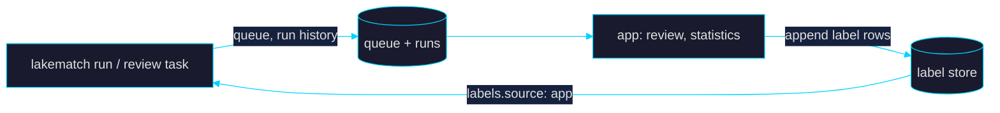

# lakematch arbitration app

*The review queue for lakematch: the pairs the model is least sure about, labelled from the keyboard, fed back into the next training run.*

   

> **Licence.** This directory is a separate sub-project. It was generated with [APX](https://github.com/databricks-solutions/apx)
> (`apx init`, addons `ui`, `sidebar`), whose code is provided under the **Databricks License**: use in connection with
> Databricks services only. The lakematch engine (`../src`, Apache-2.0) never imports from `app/`; the app never imports
> the engine either. They share one contract, the label table's columns (`../src/lakematch/labels/store.py`
> `STORE_COLUMNS`), which `tests/test_contract.py` checks.

---

## What it does

| Page | |
|---|---|
| **Review** | One pair at a time, both records field by field (differences highlighted), why it was queued, the model's probability and version, the LLM's opinion. Keyboard-first: `M` match, `N` no match, `U` unsure, `1`–`4` reason code, `/` own words, `S` skip, `Z` undo, `?` help. |
| **Statistics** | Label counts, agreement between the human and LLM labellers, precision / recall / F1 per model version (on the run's evaluation sample, and on the reviewed pairs), queue depth by reason, quarantine counts per run. |
| **Labels** | Every row of the label store with its provenance. |

The queue is written by every `lakematch run` (`../src/lakematch/review.py`): uncertainty first (LLM "unsure", then
probability nearest the threshold, ties broken by how far the candidate ranking disagrees with the decision), then
high-impact merges. Each label records the **reviewer, the time (server clock, UTC), the model version and its
probability for the pair, the threshold, why the pair was queued, the LLM's opinion and the reason**. The store is
append-only: undo appends a `retract` row, a pair's label is its latest row, `unsure` is kept but never trains.

With `labels.source: app` the next run trains on the reviewers' match / no-match decisions, over the labels of
`labels.app_base`.



---

## Storage

| | laptop (`apx dev`) | Databricks App |
|---|---|---|
| queue, run history | `<storage.root>/review/queue/` (Parquet), `runs.jsonl` | `workspace.lakematch.lm_review_queue`, `lm_review_runs` via the SQL warehouse |
| label store (default) | Delta directory `<storage.root>/review/labels` | Delta table `workspace.lakematch.lm_review_labels` |
| label store (`paid_features.lakebase_label_store`) | the dev server's embedded Postgres | a Lakebase table; the engine reads it through the database catalog registered in Unity Catalog (`labels.store.table`) |

Nothing is kept in memory between requests, so a restart (Free Edition stops an app after 24 h) loses nothing.

| Variable | Default | |
|---|---|---|
| `LAKEMATCH_APP_SOURCE` | `local` | `local` or `warehouse` |
| `LAKEMATCH_APP_LABEL_STORE` | `delta` | `delta` or `lakebase` |
| `LAKEMATCH_APP_REVIEW_DIR` | — | local: `<storage.root>/review` of a laptop run |
| `LAKEMATCH_APP_SCHEMA` | `workspace.lakematch` | warehouse: the schema of the tables above |
| `DATABRICKS_SQL_WAREHOUSE_ID` | — | warehouse: set by the app's `sql-warehouse` resource |
| `LAKEMATCH_APP_LAKEBASE_TABLE` | `lakematch.review_labels` | lakebase |
| `LAKEMATCH_APP_LOCAL_USER` | OS user | the reviewer's name on a laptop (Databricks Apps sends the signed-in user) |

---

## Quick start (laptop)

```bash
cd ~/Projects/Pro/lakematch && source scripts/env.sh
lakematch run --config examples/febrl4_review.yaml          # writes data/runs/febrl4_review/review/
cd app && cp .env.example .env && apx dev start              # prints the URL; apx dev stop when done
```

The end-to-end test (run, 20+ labels over HTTP, restart, next run, bundle size) is `python bench/app_e2e.py` →
`bench/results/app_e2e.json`.

## Deploy (Databricks)

```bash
bash app/scripts/deploy.sh                                   # refuses unless paid_features.app is on
databricks apps stop lakematch --profile fourth-pat          # app compute bills while it runs
```

The queue on Databricks is written by the engine bundle's `review` job task (`../bundle/resources.yml`).

## Development

```bash
apx dev check          # tsc + ty
uv run pytest          # backend over HTTP, label contract with the engine
apx build              # .build/: wheel + app.yml (must stay under 10 MB)
```

```text
app/
├── app.yml                  Databricks Apps runtime (env, sql-warehouse resource)
├── databricks.yml           the app's own bundle (app "lakematch")
├── scripts/deploy.sh
├── src/lakematch_app/
│   ├── backend/             FastAPI: router, review service, stores, settings (+ APX core/)
│   └── ui/                  React + TanStack Router + shadcn/ui; lib/api.ts is generated from the OpenAPI schema
└── tests/
```

## License

Generated with APX; the APX-derived code is under the Databricks License (see the note at the top). The lakematch
engine in the parent directory is Apache-2.0.
