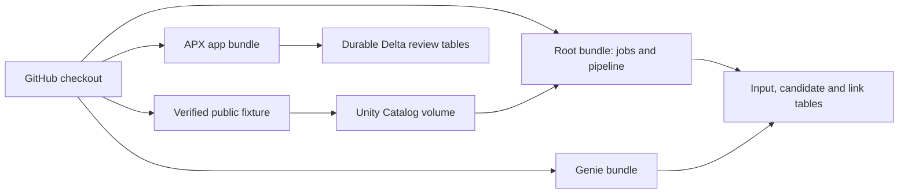

# Redeploy LakeMatch from GitHub

This runbook targets the explicitly selected `fevm-gdpr2` profile and preserves
existing resources and review data. Install `uv`, Databricks CLI 1.17.0 and APX
0.3.8 (which supplies Bun). The engine uses Python 3.12/Java 17; the isolated app
uses Python 3.11. Authenticate the profile locally; credentials are not committed.

The workspace, Unity Catalog metastore and `gdpr2_catalog` managed storage are
external prerequisites. The deploying user needs permission to manage the
campaign's schema, volume, jobs, pipeline, app, Genie and warehouse, and to grant
the app principal access to its tables. These are development resources with
synthetic data, no schedule and no continuous pipeline.



| Unit | Managed resources | State path suffix |
|---|---|---|
| Root bundle | Frozen inference job, triggered pipeline, train/cluster fixture job | `lakematch/20260919/bundle` |
| App bundle | Review app, warehouse binding, Delta environment | `lakematch/20260919/review-bundle` |
| Genie bundle | Space, exported definition, query warehouse binding | `lakematch/20260919/genie-bundle` |
| Bootstrap script | Missing schema, volume, owned warehouse, app tables/grants | Name-based, create-if-absent |

State paths are under `/Workspace/Users/laurent.fabre@databricks.com`. Deployment
locking is enabled. Root targets `serverless` and `serverless_native` are
**alternative configurations of the same resources, state and output tables**.
Deploy/run serially; they are not isolated environments. Native mode changes
inference quality and paid-feature flags; preparation still runs the DQX parity
check. Only deployment source is synced; the app syncs only its fresh `.build`.
App and Genie have `prevent_destroy` enabled. Keep state and redeploy; do not use
bundle destroy as a recovery procedure.

## Prepare and restore

```sh
git clone https://github.com/laurentfabre/lakematch.git
cd lakematch
uv venv --python 3.12
uv pip install -r requirements-local.lock
uv pip install --no-deps -e .
python3 tools/install_hooks.py
cd app
uv sync --frozen
python3 build_deploy.py
cd ..
app/.venv/bin/python tools/bootstrap_workspace.py --profile fevm-gdpr2
# Add --apply only to create missing prerequisites:
app/.venv/bin/python tools/bootstrap_workspace.py --profile fevm-gdpr2 --apply
python3 tools/restore_frozen_inputs.py
app/.venv/bin/python tools/restore_frozen_inputs.py --upload --profile fevm-gdpr2
```

The 1.02 MiB `assets/frozen-inference-v1.zip` restores the exact public FEBRL
rows, IDF data, SQL inference state and expected results already measured.
Checks cover the archive, all 45 extracted files and `bench/freeze.json`.
No ignored MLflow folder or registry download is needed. Restore/upload refuses
to replace different content; missing-file uploads resume with the manifest last.

Bootstrap identifies the dedicated warehouse by its exact campaign name and
creates it only if absent: serverless PRO, 2X-Small, one cluster, 10-minute
auto-stop. If recreated, pass its printed ID as `--var warehouse_id=NEW_ID` on
**every app bundle command**. The smoke script discovers and passes this ID itself.
Never substitute the shared warehouse for the app's owned cleanup target.

`build_deploy.py` regenerates the API, builds with committed Vite/Bun dependencies,
then packages with APX. It checks lockfile stability and the 10 MiB per-file limit.
Plain `apx build` installs newer router development packages; use the wrapper for
deployment. Development route/API generation remains APX's responsibility.

## Jobs and pipeline

```sh
databricks bundle validate --strict -t serverless --profile fevm-gdpr2
databricks bundle validate --strict -t serverless_native --profile fevm-gdpr2
databricks bundle sync --dry-run --full -t serverless --profile fevm-gdpr2
databricks bundle plan -t serverless --profile fevm-gdpr2
databricks bundle deploy -t serverless --profile fevm-gdpr2
```

Existing state reuses jobs `489495267612522` and `1048559310465200`, and pipeline
`887f3271-3247-4082-82a9-9b62fb89e135`. A fresh deployment creates them. If only
state was lost, bind those existing resources first using
`bundle deployment bind KEY ID`; do not create duplicates over the same tables.

Deploy does not run a benchmark. `databricks bundle run frozen_pipeline -t
serverless --profile fevm-gdpr2` prepares inputs, runs inference and checks frozen
F1/quarantine parity. `cluster_fixture` creates a model and reloads it in a fresh
task; its volume path contains `{{job.run_id}}` to retain earlier receipts.
Both jobs have 1,800-second timeouts and one concurrent run. Respect the separate
campaign iteration ledger in `goal.md`.

## App and durable review store

```sh
cd app
databricks bundle validate --strict -t dev --profile fevm-gdpr2
# ONCE when adopting the existing app into empty bundle state:
databricks bundle deployment bind review lakematch-review-20260919 -t dev --profile fevm-gdpr2
databricks bundle plan -t dev --profile fevm-gdpr2
databricks bundle deploy -t dev --profile fevm-gdpr2
cd ..
app/.venv/bin/python tools/bootstrap_workspace.py --profile fevm-gdpr2 --apply --review-tables
app/.venv/bin/python tools/smoke_review_deployment.py --profile fevm-gdpr2 --report data/deployment/app-smoke.json
```

Omit `bind` on a truly fresh workspace or when already bound. Wait for the app's
principal before preparing tables. The bundle leaves compute stopped; the smoke
script starts it and invokes **bundle run**, which sends the inline environment
configuration. A bare `apps deploy --source-code-path` does not carry it.

The app principal gets catalog/schema traversal, SELECT on queue/metadata, and
SELECT/MODIFY on labels. Bootstrap never seeds, deletes or overwrites labels.
Empty storage produces an empty UI. Smoke reads frontend, authenticated session,
queue, history and statistics, then stops the owned app and warehouse in `finally`.
The complete synthetic feedback acceptance remains in `app/acceptance/`.

Use **one worker and one app instance per store**. Process serialization and
insert-only MERGE protect sequential retries, not distributed uniqueness.
Delegated Genie is disabled and no optional OAuth scopes are requested. The
standalone space does not establish delegated-Genie acceptance.

## Standalone Genie space

```sh
cd genie
databricks bundle validate --strict -t dev --profile fevm-gdpr2
# ONCE when adopting the existing space into empty bundle state:
databricks bundle deployment bind matching 01f1b55eb48a1c0bae6f117fbdbc064e -t dev --profile fevm-gdpr2
databricks bundle plan -t dev --profile fevm-gdpr2
databricks bundle deploy -t dev --profile fevm-gdpr2
cd ..
```

`genie/lakematch.geniespace.json` is the authoritative live export. The original
`build_space.py` and `serialized_space.json` remain authoring drafts; deployment
does not regenerate random IDs. The space retains its title, four tables and
shared query warehouse `4aaa742e4712c3c9`. If absent, pass a suitable existing
warehouse with `--var warehouse_id=NEW_ID` on every Genie bundle command.
Do not stop or alter the shared warehouse in this runbook.

The opt-in smoke below cross-checks Genie's link count with direct SQL:

```sh
app/.venv/bin/python tests/smoke/ask_genie.py --profile fevm-gdpr2 --report data/deployment/ask_genie.json
```

On a new workspace, create the configured parent folder first with `databricks
workspace mkdirs /Users/laurent.fabre@databricks.com/genie_spaces --profile
fevm-gdpr2`. Populate the four tables using the frozen pipeline. A different
catalog/schema requires remapping every table/SQL reference in the export and
updating bundle paths and campaign-specific bootstrap constants. This is a
campaign recovery runbook, not automatic cross-account migration.

## Recovery boundaries

Git holds source, exact inference inputs and evidence. It does not back up
workspace identities, secrets, remote MLflow history, review labels or arbitrary
Unity Catalog data. Existing Delta labels survive app redeployment; disaster
recovery needs the normal Unity Catalog backup policy. Historical ignored
MLflow benchmark archives require their original artifact store for replay;
the deployed frozen inference pipeline does not depend on them.

See [REDEPLOYMENT.md](../bench/REDEPLOYMENT.md) for performed checks and
[goal.md](../goal.md) for acceptance limitations that deployment does not erase.
