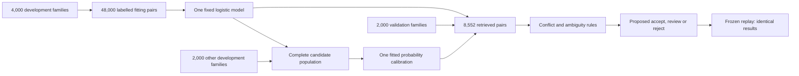

# Company matching: calibrated suggestions and an exact replay

**LF-B's matching foundations are complete at 12/12 experiments.** On the
declared synthetic validation workload, the fixed model proposes 3,400 correct
matches from 4,000 ERP companies. It leaves 600 companies unresolved. These are
offline suggestions: no company was merged automatically, and the application
does not yet show these model scores.

The final replay loaded the saved model and reproduced every candidate, score,
band and validation metric exactly. It did not retrain or choose thresholds.
Confirmation data remains unmaterialized; replay is a reproducibility check,
not another independent accuracy measurement.

The model compares names, countries, registration identifiers and address fields.
Calibration adjusts its probability estimates using a separate candidate
population, with its actual mix of matches and nonmatches. Family IDs, labels,
record keys and source identity never enter model features. Whole families stay
together, and fitting, calibration and validation families are disjoint.

| Synthetic validation measurement | Result |
|---|---:|
| ERP companies / CRM records | 4,000 / 4,000 |
| Retrieved candidate pairs | 8,552 |
| Known true matches retrieved | 3,800 / 4,000 — **95%** |
| Proposed accepted matches after conflict/ambiguity rules | **3,400 — 85% coverage** |
| Observed incorrect proposed accepts | **0** |
| Unresolved ERP companies | **600 — 15%** |
| True matches rejected by the proposed reject band | **0** |
| Proposed review / reject candidate pairs | 4,705 / 447 |
| Audited accepts with no repeated endpoint family | **1,952**, all correct |
| One-sided 95% audit precision lower bound | **99.8466%** |
| Lower bound adjusted for selecting among seven thresholds | **99.7472%**, above 99.5% |
| Raw → calibrated validation Brier score (lower is better) | **0.009266 → 0.000601** |
| Raw → calibrated validation calibration error, ten bins | **0.028040 → 0.003591** |

The 600 unresolved companies comprise **400 identifier/country collisions**,
which the rules keep in review, and **200 combined-error cases** whose correct
counterparts were not retrieved. The latter are the same known weakness of the
selected name/identifier retrieval method. No positive was lost to the candidate
cap; the largest shortlist had seven records.

Candidate-pair review counts and unresolved-company counts have different
denominators. A resolved company can still have other candidate pairs marked
for review. All real worker routes remain review; the table describes a proposed
policy's behavior, not work already removed from a steward's queue.

The selected numerical boundaries are reject below **0.1**, review in between,
and accept at least **0.9**, before vetoes. They belong only to this frozen model,
calibrator, feature definition and workload. They are not generic product defaults.
The 99.7472% bound uses a predeclared, label-blind, family-disjoint audit and a
Bonferroni correction across seven candidate thresholds. It is not the confidence
bound of all 3,400 correlated pairs or an accuracy guarantee on customer data.
The report also retains 200 ERP-family bootstrap replicates; those intervals are
descriptive because retrieval may connect families.

The current synthetic app already explains source conflicts, as shown in its
earlier fresh-package acceptance. Connecting the new probability model to live
application data and approved actions remains later work.

| Run | Source | Outer elapsed time | Main-process peak RSS | Outcome |
|---|---|---:|---:|---|
| [Slot 11: fit, calibrate, select](../../experiments/20260922T185559Z-lf-b-calibration-053b3f/manifest.json) | `785b0ca` | 19.18 s | 267.4 MiB | Completed; validation selection passed |
| [Slot 12: frozen replay](../../experiments/20260922T185844Z-lf-b-calibration-replay-b61ed0/manifest.json) | `06bfcfe` | 9.16 s | 132.6 MiB | Exact validation digest match |

Both runs stayed within the 900-second outer and 4-GiB measured-memory limits.
They started no Spark session, database, service, cloud resource or AI request.
The runner verified owned-process cleanup. **320 portable checks passed** in
the source commit hooks: 19 new calibration tests, 297 mastering/regression
checks and four source-hygiene checks. NumPy and portable scalar probabilities
agreed within 4.45e-16 on all 48,000 fitting pairs.

All fifteen frozen Phase A files are unchanged. The selected retrieval reproduces
the earlier 8,552 pair identities and method provenance exactly. The earlier UI
acceptance remains evidence for source `938fe86`: 88 of its 89 bound inputs are
unchanged. The sole difference is an optional `calibration` dependency group in
the root package; the same numerical versions already existed in the root lock.
The app's separate environment, package, source, demo and dependency locks are
unchanged. This compatibility review reuses that UI evidence; it does not claim
a new app build or deployed acceptance.

The complete [fit report](../../bench/lakefusion/calibration-20260922.json),
[replay report](../../bench/lakefusion/calibration-replay-20260922.json),
[inspectable JSON model](../../bench/lakefusion/calibrated-model-v1.json),
[predeclared plan](../../bench/lakefusion/CALIBRATION_PLAN.md),
[input/family manifest](../../bench/lakefusion/calibration-inputs-v1.json) and
[replay freeze](../../bench/lakefusion/calibration-replay-freeze-v1.json) retain
the parameters, dependencies, hashes, reliability bins and every threshold's
outcome. Bulk scored pairs remain ignored and are referenced by hash.
The [read-only verification receipt](verification.json) records frozen-input,
artifact, ledger, package-status and UI compatibility checks after both runs.

LF-B closes the declared internal worker and synthetic UI foundations. LM-014
remains in progress: untouched confirmation, representative real-domain evidence,
durable model/rule approval, live score display, authorization and explanation
fidelity are unachieved. Operational tasks, approvals and command recovery move
to Phase C. All 12 LF-B slots, including earlier failures, remain consumed.
