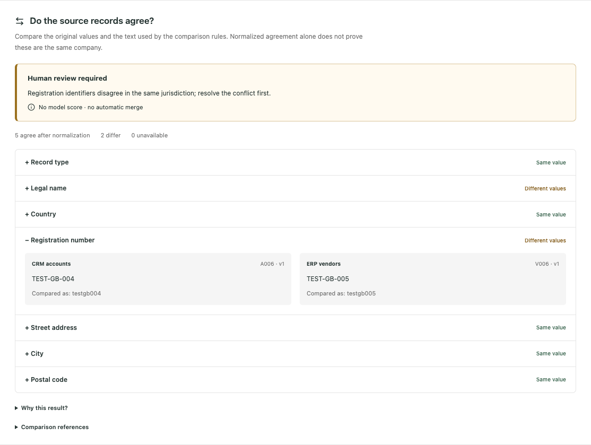

# See why company records need review

The synthetic APX demo now displays actual field comparisons for **six companies
across two publications**. Open **Golden records**, choose a company, and expand
the fields under **Do the source records agree?** Original values appear beside
the text used for comparison. The reason for review or exclusion stays visible.



[Normalized names](preview/comparison-normalization.png) ·
[Full desktop view](preview/golden-desktop.png) ·
[Earlier publication](preview/golden-history.png) ·
[Phone layout with a deleted source](preview/golden-mobile.png)

Try these examples:

- **Harbor Industrial Ltd:** ERP and CRM registration numbers differ. Review is
  required even though five other fields agree after normalization.
- **Cedar Logistics SAS:** the original names differ, while the normalized names
  agree. Both original and comparison values remain visible.
- **Atlas Supplies SAS:** publication 2 excludes the deleted CRM record from new
  matching. Publication 1 still explains its earlier values.
- **Cedar Components SA:** switch publications to compare the earlier conflicting
  street addresses with the later source update and approved name edit.

The fixture supplies company memberships. These comparisons do not discover
candidates, supply model probabilities, approve merges or modify master records.
The app reads a packaged projection of the portable comparator's output. Its
existing session dependency is retained; live data and domain/field authorization
remain future integration work.

## Observed development checks

On 2026-09-22, **301 portable tests and 25 app tests pass**, with no failures or
skips. [Portable JUnit](portable-tests.xml) and [app JUnit](app-tests.xml) preserve
the results. The app tests cover all twelve projections, source versions/values,
conflicts, normalization, deletion/history and inconsistent package rejection.
The worker tests include explicit pair origin and probability replay.

The [browser receipt](preview/preview.json) records desktop **1440 × 1100** and
mobile **390 × 844**, no page errors and no horizontal mobile overflow. Keyboard
disclosure, history, normalization/conflict views and recovery after a simulated
503 response pass. The screen issued only GET requests and never fetched the
review queue/statistics/review history or wrote reviews. The bounded runner
closed its owned browser/server and removed the disposable store directory.

APX Python/TypeScript checks pass. Its check command temporarily advanced two
router development dependencies; the original package and lockfiles were restored
and the pinned build reinstalled those versions. Direct TypeScript and Python
checks then passed against the restored dependencies. The build contains **four
deployment files**, largest **163,466 bytes**, below the 10 MiB limit. The wheel
includes the **191,907-byte** schema-2 demo JSON.

Two local APX invocations crashed inside the sandbox while reading macOS system
configuration. The APX check passed outside that restriction; direct TypeScript
compilation avoids that launcher issue. The native browser connector could not
open because its Chrome profile was already in use, so preview used an isolated
Playwright browser. No existing browser was stopped. The unused native-preview
server had a two-minute bound and was also cleaned up.

The existing Vite config-loader notice and upstream AnyIO deprecation notice
remain non-failing warnings. [Source/check receipt](checks.json) records hashes,
package contents, preserved inputs and cleanup. Dependency pins, both historical
publication hashes, all 15 Phase A frozen files and the four refreshed scan reports
remain unchanged.

This is a local development increment under the
[declared plan](../../bench/lakefusion/COMPARISON_UI_PLAN.md). **LF-B remains 8/8**.
No pilot corpus evaluation, model fitting, threshold search, confirmation release,
remote experiment or deployment occurred. Full acceptance awaits a revised bound.

## Reproduce

Follow [app setup](../../app/README.md). From `app/`, run
`python3 build_deploy.py`; open `/#golden-records` on the local app. The packaged
demo needs no workspace account or earlier experiment output.

From the repository root, verify the export with:

```sh
.venv/bin/python tools/build_golden_demo.py --check
```

For the scripted browser preview, use the documented local Playwright setup in
the [previous preview guide](../lakefusion-ui-20260922-final/README.md), then:

```sh
.venv/bin/python tools/preview_golden_app.py --output reports/my-new-comparison-preview
```

The output directory must be new. Startup has a 20-second bound, the browser a
90-second bound, and cleanup up to 10 seconds. This is a read-only display check.
