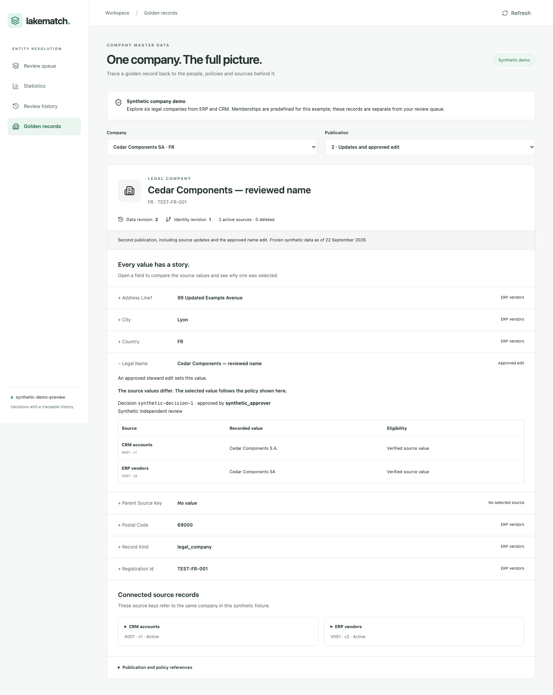

# Golden records: local development preview

The APX screen explains **six synthetic legal companies across two publications**.
It shows every published field, the chosen source or approved edit, alternative
source values, deleted records and separate data/identity revisions. Company
memberships are fixture declarations; this screen is not matching-quality proof.



[Earlier publication](golden-history.png) · [Phone layout](golden-mobile.png) ·
[Preview receipt](preview.json)

Observed on 2026-09-22: desktop **1440 × 1100**, mobile **390 × 844**, no browser
page errors, no horizontal page overflow. Switching publications shows the old
name; the second Atlas publication marks its CRM source deleted. Only read
requests were issued; the screen did not fetch the review queue/statistics or
write reviews. The owned loopback server was stopped and its temporary database
directory removed. No remote workspace resource was used.

The first browser check stopped at a publication-selector lookup. Its implicit
accessible label included the options; explicit selector labels fixed that
issue. The [initial output](../lakefusion-ui-20260922/README.md) is retained.
One initial API test also used an incorrect fixture company name; correcting the
expectation produced the final **19 passing app tests**.

The pinned APX build passes: **4 deployment files**, largest **156,717 bytes**,
below the 10 MiB limit. The wheel contains the **126,628-byte** synthetic JSON.
APX type checks pass; final direct checks against the restored lockfile also pass.
The build's Vite config-loader future-compatibility notice and the test client's
upstream AnyIO deprecation notice remain non-failing warnings. Dependency pins
are unchanged.

This is a **development preview**, not a new campaign acceptance experiment.
LF-B stays at 8/8; full acceptance of the next increment requires a revised bound.
Customer-data adapters, domain/field authorization and scalable live entity
routes remain open. The existing review workflow retains its own earlier evidence.

## Reproduce

Follow [app setup](../../app/README.md), build with
`python3 build_deploy.py` from `app/`, and open `/#golden-records` on the local app.
The sample is already packaged; no prior experiment, Spark or Databricks account
is required to view it. Optional regeneration from the repository root:

```sh
.venv/bin/python tools/build_golden_demo.py --check
```

For the read-only screenshot check, use a local Playwright installation (set
`LAKEMATCH_PLAYWRIGHT_MODULE` to its absolute module directory if it is outside
the app). Set `LAKEMATCH_CHROMIUM_EXECUTABLE` when using an installed Chrome
instead of Playwright's Chromium. From the repository root:

```sh
.venv/bin/python tools/preview_golden_app.py --output reports/my-new-preview
```

The output directory must be new. The runner has a 20-second startup bound,
90-second browser bound and up to 10 seconds reserved for cleanup. It always
terminates its owned server. It never starts a matching/training experiment.
