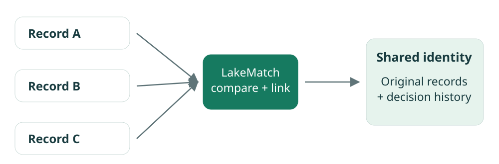
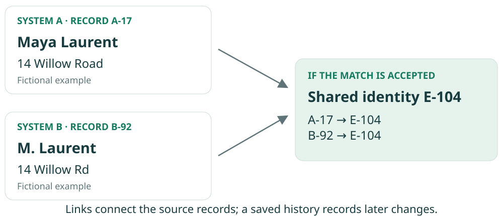
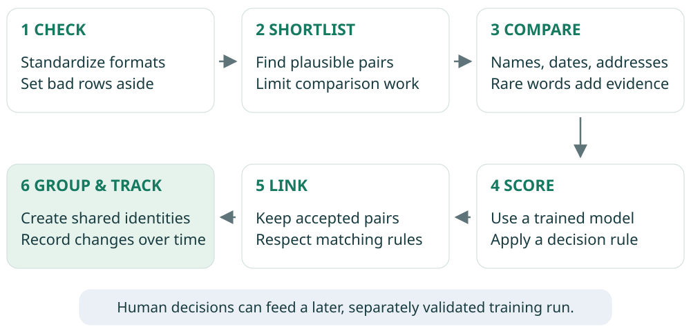
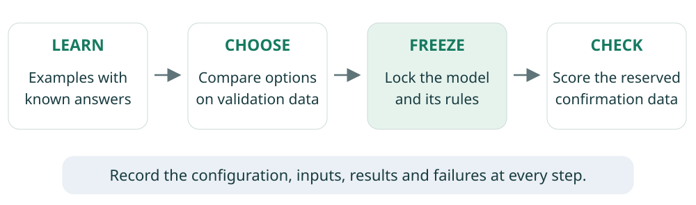
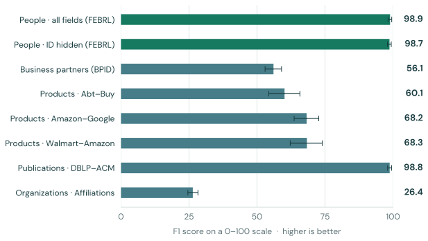
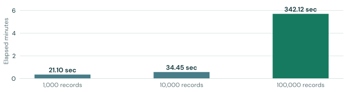
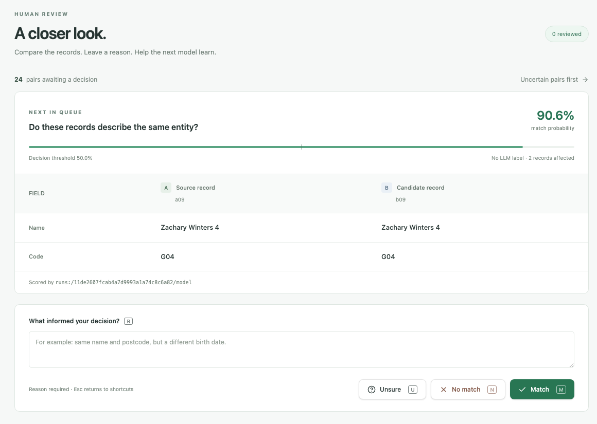
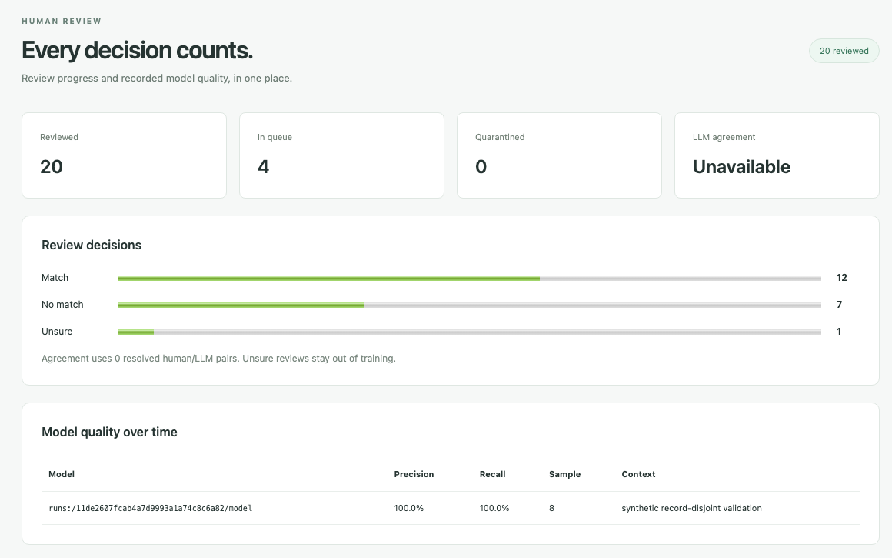
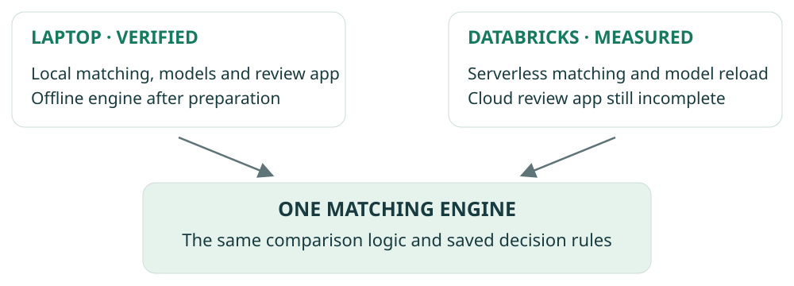

PROJECT EXPLAINER · SEPTEMBER 2026

<h1>LakeMatch</h1>

How we connect records that belong together

A plain-language guide to the matching engine, the human review process, and the evidence behind the results.

<figure></figure>

<b>98.9</b>F1 score out of 100 on a synthetic people test

<b>100,000</b>synthetic records processed in the scale test

<b>20</b>review decisions saved in the local app test

<strong>Current position:</strong> the core matching engine and local review workflow have been demonstrated. The full project is still incomplete: larger-scale processing and several cloud acceptance checks remain open.

For operations, business, and project teams · Evidence as of 20 September 2026 Prepared with Codex from the private LakeMatch repository, tested version <strong>910a418</strong>.

01 / THE BUSINESS PROBLEM

# Different records, one real thing

The same person, company, or product can appear in several systems. Names may be abbreviated, an address may use a different format, or a useful identifying field may be missing. Counting each row as a different entity can create duplicate work and misleading totals.

**LakeMatch looks for records that describe the same entity.** This is called *entity resolution*. It produces links and shared identifiers that downstream systems can use to connect related records.

<figure><figcaption>Figure 1. An illustrative data schema using fictional values. This example explains the idea; it is not a recorded model prediction.</figcaption></figure>

## What the output means

| Output | Meaning for a business user |
|---|---|
| A link | “These two records appear to describe the same entity.” |
| A shared identity | Several source records can be associated with one identifier. |
| A change history | Later merges, splits, or identifier changes remain traceable. |
| A quarantine list | Rows that fail configured data checks are set aside with reasons. |

The output supports use cases such as reducing duplicate records and reconciling lists. Those business benefits still need to be measured on each intended workflow; this campaign did not establish financial savings or production results.

Sources: [1], [2], [7]. All campaign inputs were public or synthetic data.

02 / HOW MATCHING WORKS

# Turn clues into a decision

The engine narrows the search before making detailed comparisons. This avoids trying every possible pair, which becomes expensive as lists grow. The shortlist is important: a genuine match missed here cannot be recovered by the later scoring step.

<figure><figcaption>Figure 2. The matching and feedback workflow. Configurations determine which fields and matching rules apply.</figcaption></figure>

## What counts as a clue?

| Clue | How LakeMatch uses it |
|---|---|
| Similar spelling | Measures differences in names or other text. |
| Shared words | Gives rarer words more weight than very common ones. |
| Field-specific detail | Compares dates, numbers, addresses, codes, and organization names appropriately. |
| Several clues together | A trained model combines evidence into a score; a chosen rule decides whether to link. |

A score is a model estimate, not a guarantee. Some tasks also constrain the result: for example, one record may be allowed to match only one record in another list. Ambiguous pairs can enter the review queue.

The default engine uses conventional machine learning and native data-processing operations. A generative AI service is optional and is off by default; it is not required to make the reported offline matches.

Sources: [2], [3]. The shortlist, model, thresholds, and grouping rules are stored with the model so a result can be reproduced.

03 / HOW THE WORK WAS DONE

# Build, test, measure, preserve

I worked in small stages: implement a capability, run bounded tests, inspect the failures, and retain the results before moving on. The engine is an independent implementation. Its optional Databricks integrations and review app are kept separate from the core package.

<figure><figcaption>Figure 3. Separate learning and evaluation steps help prevent a model from being judged only on examples used to choose it.</figcaption></figure>

## The practical sequence

1. **Define success first.** Record data sources, matching rules, quality targets, resource limits, and the evidence required for each phase.
2. **Build a portable engine.** Add data checks, candidate selection, comparisons, scoring, shared identities, and saved model versions.
3. **Compare alternatives.** The classifier study completed **81 model fits** across nine dataset configurations. Simpler baselines and feature-removal experiments helped identify which ingredients mattered.
4. **Freeze and check.** Lock the chosen models and rules before confirmation scoring. Later replays checked that code changes preserved the saved predictions.
5. **Exercise real workflows.** Run locally and on Databricks serverless; test human review, training feedback, persistence, and recovery after interruption.
6. **Keep an audit trail.** Save configurations, source versions, input fingerprints, results, failures, and cleanup records; push the committed implementation to GitHub.

<b>130</b>same engine tests passed in each of two local execution modes

<b>8</b>frozen model replays reproduced identical decisions

<b>11</b>app regression tests passed at the report’s evidence snapshot

Sources: [1], [2], [3], [4], [10]. The 130 tests are repeated across environments, not 260 distinct tests. Test counts demonstrate checks performed, not complete coverage.

04 / QUALITY RESULTS

# Strong results depend on the data

**F1 balances two questions:** how many proposed matches are correct (*precision*), and how many real matches are found (*recall*). The chart expresses F1 on a 0–100 scale. It is not the percentage of all records correctly handled.

<figure><figcaption>Figure 4. Frozen-model results. Thin lines show 95% uncertainty intervals estimated by resampling. Dataset difficulty and evaluation procedures differ, so these rows are not a like-for-like ranking of use cases.</figcaption></figure>

## A concrete reading of the people test

On the all-fields FEBRL confirmation set, LakeMatch found **489 of 500 true links**, missed **11**, and recorded **zero false links**. That produced **100% precision**, **97.8% recall**, and **98.89 F1**. Zero observed false links in this test does not promise zero future errors.

With the social-security identifier hidden, F1 remained **98.68**. The original frozen local runs took **29.19 seconds** and **27.30 seconds**, including process startup, model loading, output, and cleanup. Both met their local quality and under-60-second targets.

<strong>The weak result matters too.</strong> Organization affiliations reached only <strong>26.39 F1</strong>: precision was high, but many true links were missed. A new business dataset needs its own evaluation and review policy.

Source: [4]. FEBRL uses synthetic people and new confirmation splits from a previously exposed corpus, not a new real-world population. Other rows score supplied held-out pairs after retrieval; shared-record caveats remain in the benchmark reports. No competitor superiority is claimed.

05 / SCALE AND LIMITS

# What happens as the lists grow?

The scale exercise increased synthetic input size while keeping the local processing and memory settings fixed. It used exact duplicate records with unique codes. This checks workload growth and resource limits; it does not reproduce every kind of messy business data.

<figure><figcaption>Figure 5. Completed scale tests, including training, data generation, matching, saved outputs, and cleanup. These timings have a broader scope than the frozen-model timings on the previous page.</figcaption></figure>

| Total records | F1 / 100 | True matches retained in shortlist | Result |
|---|---:|---:|---|
| 1,000 | 100.00 | 100.00% | Completed |
| 10,000 | 100.00 | 100.00% | Completed |
| 100,000 | 97.72 | 95.55% | Completed in 5 min 42 sec |
| 1,000,000 | Not measured | Not measured | Failed after 11 min 13 sec |

## Why the largest test failed

The million-record attempt exhausted available Java memory while preparing candidate pairs. Intermediate comparisons can be much larger than the final list of matches: the failed tier recorded about **8.45 billion prospective join rows** before limits reduced the work.

Limits protect the system, but can discard genuine matches. In a separate stress test of **2,000 indistinguishable records**, the system dropped the unselective comparison groups and retained none of the true matches.

<strong>Measured boundary:</strong> processing is demonstrated through 100,000 synthetic records in this setup. There is no successful million-record quality, throughput, or cost result. The failed test remains in the evidence.

Source: [5]. Local Spark used two execution threads and unchanged default JVM memory. These are environment-specific measurements, not capacity guarantees.

06 / THE HUMAN REVIEW EXPERIENCE

# A person can resolve uncertainty

The review app brings two records together, shows their model score, and asks the reviewer to choose **Match**, **No match**, or **Unsure**. It prioritizes pairs closest to the decision threshold; affected-record counts help break ties.

<figure><figcaption>Figure 6. Actual local APX review app from the preserved acceptance test, using synthetic records. Cropped for readability. The displayed score describes this example pair; it is not an overall accuracy measure.</figcaption></figure>

1. **Compare the fields.** Look at the records and their differences, using your domain knowledge.
2. **Leave a reason.** Explain the evidence behind the decision. A reason is required before saving.
3. **Choose an outcome.** Use the buttons or keyboard shortcuts: **M** for match, **N** for no match, **U** for unsure.

The app saves the reviewer, time, model version, decision, and reason. Repeating the same save request returns the original review. The local test also checked review history, a mobile layout, and persistence after stopping and restarting the app.

Sources: [10], [11]. The acceptance run saved 20 reviews through the app’s HTTP interface; one used the keyboard workflow. This is a tested local app. Its cloud deployment is still incomplete.

07 / FEEDBACK AND ACCOUNTABILITY

# Reviews become traceable learning inputs

Human feedback is useful only if it reaches the next training run correctly. The acceptance test checked the exact saved labels, not just that a “Save” message appeared.

<b>20</b>saved reviews

→

<b>19</b>resolved training labels

→

<b>1</b>verified training snapshot

The test recorded **12 matches**, **7 non-matches**, and **1 unsure decision**. The unsure decision stayed in history and was excluded from training. The normal training command consumed exactly the 19 resolved labels, verified by a digital fingerprint of the label set.

<figure><figcaption>Figure 7. Actual local statistics screen after review. The small eight-pair model evaluation shown at the bottom is a workflow fixture, not the benchmark study. “Unavailable” means no measurement was present.</figcaption></figure>

## History survives change

An actual app restart preserved the reviews and training snapshot. Separate identity tests checked that unchanged records kept their shared IDs, and that additions, edits, deletions, merges, and splits produced a replayable history.

These checks establish that feedback reaches training and records survive restart. They do not establish that 19 labels improve quality on a production population; that requires a separate evaluation.

Sources: [7], [10], [11]. Identity tests used validation subsets of 1,050 and 10,082 records. The screenshots are preserved campaign evidence; no new experiment was run to produce this document.

08 / WHERE IT RUNS

# One engine, two operating settings

LakeMatch was designed to use the same matching logic on a laptop and in Databricks, the cloud data platform used for this campaign. The surrounding storage and execution services differ.

<figure><figcaption>Figure 8. Deployment schema. “Serverless” means Databricks manages the underlying compute; it does not mean there is no compute charge.</figcaption></figure>

| Component | What it does |
|---|---|
| Spark | Processes and compares records, locally or in the cloud. |
| MLflow | Stores model versions, settings, evaluation results, and training provenance. |
| Delta tables | Store durable cloud data and publication history. |
| APX review app | Presents uncertain pairs and records human decisions. |
| Genie, planned | Would let users ask questions about results; the delegated app flow is untested. |

## What the cloud tests established

Both tested serverless configurations reproduced the frozen local FEBRL F1 scores **exactly**. They also set aside the intentionally bad input rows. Separate checks demonstrated model registration, reload in a fresh task, and recovery of published data on a small synthetic fixture.

## What remains to be measured

Detailed evidence about which processing stages use Databricks’ Photon accelerator and the campaign’s attributed compute charges remains incomplete. No cloud speed advantage or cost saving follows from the successful quality checks alone.

Sources: [8], [9], [10], [12]. The review app and optional integrations have separate dependencies and license terms from the Apache-2.0 engine. The repository remains private.

09 / PROJECT READINESS

# What is ready, and what comes next?

**Four of the nine specified phases have passed their acceptance checks.** This is a count of completed gates, not an estimate that 44% of the effort is finished. Several remaining phases contain substantial working functionality.

| Phase | Business meaning | Recorded position |
|---|---|---|
| 1 · Core engine | Install, configure, check data, and match records | **Passed** |
| 2 · Comparisons | Support the required field types and compare features | **Passed** |
| 3 · Benchmarks and scale | Establish quality and larger-data behavior | **Blocked:** million-record failure |
| 4 · Shared identities | Group records and preserve change history | **Passed** |
| 5 · Model management | Save, register, and reproduce model decisions | **Passed** |
| 6 · Cloud processing | Reproduce matching in serverless pipelines | **Partial:** profiles and billing missing |
| 7 · Review app | Save reviews and feed them into training | **Local verified; cloud incomplete** |
| 8 · Questions through Genie | Ask questions through the app as the user | **Pending** |
| 9 · Classic cloud compute | Check the alternative cloud execution mode | **Unavailable in this workspace** |

## The next practical steps

- **Complete cloud review acceptance.** A fix for waiting until app provisioning finishes is prepared. A further bounded run requires authorization because the phase’s eight-iteration limit was reached.
- **Address the scale failure.** Define a new, approved experiment around intermediate comparison and memory usage, keeping the unsuccessful million-record result visible.
- **Close cloud evidence gaps.** Obtain detailed query profiles and attributed billing, then validate the delegated Genie workflow after app acceptance.
- **Resolve the classic-compute requirement.** The selected workspace explicitly supports serverless only; capability or scope must change before that phase can proceed.

The final recorded cleanup left the campaign app and owned warehouse stopped, and its pipeline idle. Models and evidence were retained. Missing billing data is recorded as unknown, not as zero cost.

Sources: [1], [6], [9], [10], [12]. Status reflects the tested campaign snapshot, not a fresh remote inventory.

10 / SOURCES AND READING GUIDE

# Where the numbers come from

This report summarizes preserved evidence from commit **910a4188e2ff11088ac55601494b4e0730f74c70**, dated **20 September 2026**. It adds explanations and diagrams, not new performance measurements. Links below require access to the private GitHub repository.

| Ref. | Source | What it supports |
|---|---|---|
| [1] | [Goal and acceptance ledger](https://github.com/laurentfabre/lakematch/blob/910a418/goal.md) | Authoritative phase status, scope, limits |
| [2] | [Project overview](https://github.com/laurentfabre/lakematch/blob/910a418/README.md) and [field comparisons](https://github.com/laurentfabre/lakematch/blob/910a418/bench/FEATURES.md) | Engine behavior, tests, portability |
| [3] | [Method selection](https://github.com/laurentfabre/lakematch/blob/910a418/bench/METHODS.md) | 81 fits, selected methods, caveats |
| [4] | [Frozen benchmarks](https://github.com/laurentfabre/lakematch/blob/910a418/bench/BENCHMARKS.md) | F1, precision, recall, intervals, timing, replays |
| [5] | [Scale measurements](https://github.com/laurentfabre/lakematch/blob/910a418/bench/SCALE.md) | Successful tiers, memory failure, stress test |
| [6] | [Remaining gates](https://github.com/laurentfabre/lakematch/blob/910a418/bench/BLOCKERS.md) | Blockers and eligible next steps |
| [7] | [Identity evidence](https://github.com/laurentfabre/lakematch/blob/910a418/bench/IDENTITY.md) and [clustering](https://github.com/laurentfabre/lakematch/blob/910a418/bench/CLUSTERS.md) | Stable identifiers and change history |
| [8] | [Model acceptance](https://github.com/laurentfabre/lakematch/blob/910a418/bench/MODELS.md) | Saved model contract and fresh-task reload |
| [9] | [Serverless evidence](https://github.com/laurentfabre/lakematch/blob/910a418/bench/SERVERLESS.md) and [Photon report](https://github.com/laurentfabre/lakematch/blob/910a418/bench/PHOTON.md) | Local/cloud parity and missing cost evidence |
| [10] | [App acceptance](https://github.com/laurentfabre/lakematch/blob/910a418/bench/APP.md) and [structured audit](https://github.com/laurentfabre/lakematch/blob/910a418/experiments/app-acceptance-20260920.json) | Reviews, feedback, restart, tests, limitations |
| [11] | Preserved local app screenshots | Actual review and statistics screens; original paths and checksums in the companion figure-sources.json |
| [12] | [App resource cleanup](https://github.com/laurentfabre/lakematch/blob/910a418/experiments/app-resource-cleanup-20260920.json) | Recorded stopped resources and no deployment |

## A few useful terms

**Entity:** the real person, company, or product that a record describes. **Candidate pair:** two records worth comparing. **Model:** the learned scoring rules. **Label:** a known or reviewed match/non-match answer. **Validation:** data used to choose an approach. **Confirmation:** reserved data scored after the choice is locked. **Idempotent:** repeating an operation does not create duplicate effects.

## How to read the evidence fairly

Confidence intervals describe uncertainty in the measured sample; they do not guarantee performance on a new population. Workflow fixtures establish that a feature works on those inputs. Benchmarks assess matching quality on defined datasets. Neither alone establishes production readiness or business return.

The companion Markdown is editable. Charts are generated from the recorded benchmark tables; diagrams are original explanatory schematics. Screenshots are cropped without changing their values. Source checksums and figure provenance are saved alongside the report.

