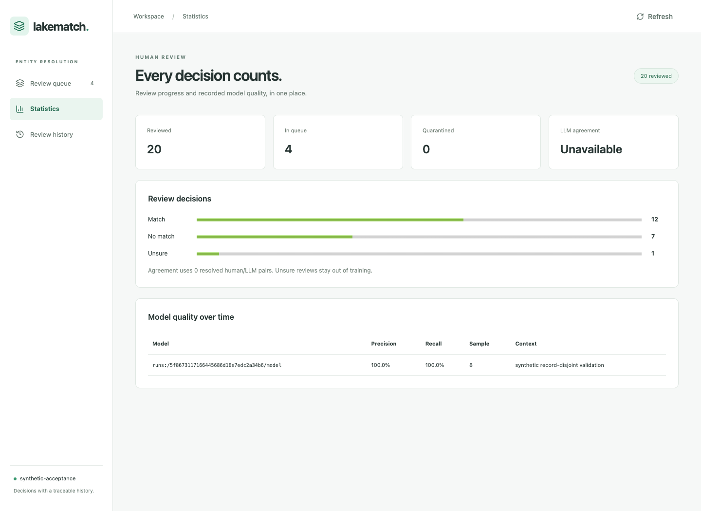
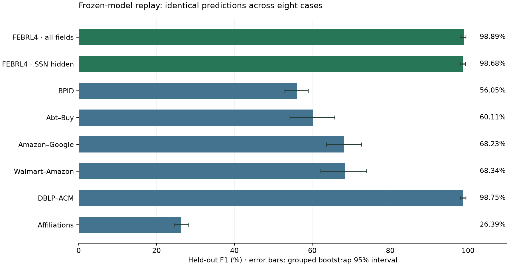

# LakeMatch test session — 21 September 2026

The current engine passed 283 regression test executions: the same 135 tests on classic Spark and Spark Connect, plus 13 app tests. No failures, errors or skips occurred. Eight frozen public-corpus cases reproduced their original predictions with a maximum score delta of zero.

**Quality remains uneven:** held-out F1 ranges from 26.39% on affiliations to 98.89% on FEBRL4. A successful replay establishes reproducibility; it does not establish acceptable quality on every dataset.

The engine under test was commit `2bee089ccfb0a8f6b1c217e47021f8d1203611f0`. This session added isolated test runners and report-path support; it changed no engine, frozen model, decision threshold or split. All execution was local. The live synthetic demo was opened at [localhost:9040](http://127.0.0.1:9040).

## Regression and app results

| Suite | Passed | Failed / skipped | Test time |
|---|---:|---:|---:|
| [Classic Spark](tests-classic.xml) | 135 | 0 / 0 | 89.17 s |
| [Spark Connect](tests-connect.xml) | 135 | 0 / 0 | 100.57 s |
| [App](app-tests.xml) | 13 | 0 / 0 | 0.82 s |

The fresh app flow prepared 20 records on each side, trained a baseline from eight labelled pairs, and used eight validation pairs from separate record groups. It queued 24 scored review pairs and saved 20 reviews, including a keyboard decision and an intentionally unsure decision. HTTP retries returned the same receipts; provenance, history, statistics, mobile layout and disabled-Genie visibility checks passed with no browser page errors.

After a Uvicorn stop/start, the complete review snapshot was identical. The normal training CLI then consumed exactly the 19 resolved labels; the unsure review was excluded. The exported label digest matched the retrained model. The app flow, including two training jobs, took 41.59 seconds. Its temporary test server was stopped. The interactive demo uses its own SQLite database.

[Browser receipt](browser-report.json) · [Restart receipt](restart-report.json) · [Training receipt](feedback-report.json)

The 100% validation values in this screenshot are measured on only eight deliberately simple synthetic pairs. They are an app integration fixture, not evidence of broad matching accuracy.

## Public-corpus replays

All eight input/model hash checks passed. The runs denied outbound network access at the OS level, loaded the existing frozen models, and compared every candidate pair, score and decision against the original sealed outputs. New outputs were written under a fresh `data/test-runs/` directory.

| Corpus | Left / right records | Evaluated truth | Precision | Recall | F1 | Candidate recall | Scoring time |
|---|---:|---:|---:|---:|---:|---:|---:|
| [FEBRL4 · all fields](cases/febrl4_half_all.json) | 5,000 / 2,500 | 500 true links; 1,000 anchors | 100.00% | 97.80% | 98.89% | 97.80% | 29.47 s |
| [FEBRL4 · SSN hidden](cases/febrl4_half_no_ssn.json) | 5,000 / 2,500 | 500 true links; 1,000 anchors | 100.00% | 97.40% | 98.68% | 97.40% | 27.37 s |
| [BPID](cases/bpid.json) | 10,000 / 10,000 | 1,966 supplied pairs | 60.16% | 52.46% | 56.05% | 54.61% | 87.42 s |
| [Abt–Buy](cases/abt_buy.json) | 1,068 / 1,035 | 1,892 supplied pairs | 65.32% | 55.67% | 60.11% | 62.07% | 20.43 s |
| [Amazon–Google](cases/amazon_google.json) | 1,288 / 2,071 | 2,127 supplied pairs | 59.32% | 80.28% | 68.23% | 88.53% | 17.75 s |
| [Walmart–Amazon](cases/walmart_amazon.json) | 1,688 / 5,247 | 2,047 supplied pairs | 85.83% | 56.77% | 68.34% | 76.04% | 24.88 s |
| [DBLP–ACM](cases/dblp_acm.json) | 2,436 / 2,245 | 2,407 supplied pairs | 99.54% | 97.97% | 98.75% | 97.97% | 28.87 s |
| [Affiliations](cases/affiliations.json) | 2,257 / 2,255 | 6,896 supplied pairs | 100.00% | 15.20% | 26.39% | 15.20% | 25.71 s |

FEBRL4 scores cover the complete 5,000-left / 2,500-right universe, with metrics reported for the frozen confirmation anchors. Both variants also passed their original F1 and 60-second scoring gates. The other six rows evaluate supplied held-out labelled pairs after retrieval; unknown pairs are excluded and missed positives remain false negatives. These task types have different scopes, so no aggregate F1 is reported. Scoring times exclude the outer replay comparison and corpus-copy setup.

Affiliation matching is the weakest result at 26.39% F1. BPID candidate recall is 54.61%, so candidate generation misses almost half of the true links before classification. Product matching also remains weaker than FEBRL4. No thresholds or models were tuned against these replay outcomes.

## Corpora located

The [inventory](corpus-inventory.json) contains 11 prepared corpora and source provenance. Nine file-based manifests were independently checksum-verified. The eight frozen cases above were executed. FEBRL4 with SSN and date of birth hidden, FEBRL3 (5,000 records / 2,000 entities), and historical_50k (50,578 records / 5,156 entities) were inventoried but not rerun in this session.

Sources: recordlinkage 0.16 bundled synthetic FEBRL; [BPID on Zenodo](https://zenodo.org/records/13932202); [Ditto/Magellan fixed public splits](https://github.com/megagonlabs/ditto/tree/52985564a93fb11308439516d3e17a033d43ec8f/data/er_magellan); Leipzig affiliation strings; and Splink public historical-figure data. Original source revisions, checksums and licence notes are retained in the inventory and case reports. The raw corpora and generated model stores remain ignored.

## Evidence and reproduction

The first isolated replay stopped before scoring because its copied directory omitted a frozen selection report. That failure is retained in [the first receipt](corpus-replay.json) and [its traceback](initial-replay-error.txt). The runner now includes the required selection reports; the complete second attempt passed.

| Experiment | Status | Wall time | Exact command / source hashes |
|---|---|---:|---|
| user-tests-classic | passed | 90.59 s | [Manifest](../../../experiments/20260921T093032Z-user-tests-classic-c67707/manifest.json) |
| user-tests-connect | passed | 105.84 s | [Manifest](../../../experiments/20260921T093217Z-user-tests-connect-f66831/manifest.json) |
| user-review-flow | passed | 41.59 s | [Manifest](../../../experiments/20260921T093428Z-user-review-flow-97f1d9/manifest.json) |
| user-corpus-replay | failed | 2.42 s | [Manifest](../../../experiments/20260921T093526Z-user-corpus-replay-74af95/manifest.json) |
| user-corpus-replay-v2 | passed | 280.94 s | [Manifest](../../../experiments/20260921T093626Z-user-corpus-replay-v2-7ca2b9/manifest.json) |

Each completed experiment receipt records termination of its owned process group with no live members remaining. The user-facing demo at port 9040 was started independently and intentionally left running.

Use [the local app flow](../../../app/acceptance/local_flow.py) and [the corpus replay runner](../../../tools/replay_test_corpora.py) through `tools/experiment.py` with finite timeouts, fresh output paths, Python 3.12, Java 17, and the installed project environments. The replay needs the prepared benchmark/model stores and macOS `sandbox-exec`; the fresh app flow needs Chrome/Playwright and the built frontend. The Connect runner now accepts `--junitxml <new-path>` to preserve older results.

This session did not rerun Databricks deployment, remote Delta/Genie acceptance, clustering corpora, or the parked million-record scale tier. The prior deployment evidence remains in [the deployment audit](../../../bench/REDEPLOYMENT.md).

[Machine-readable summary](summary.json) · [Replay audit](corpus-replay-v2.json) · [App queue screenshot](app-live.png) · [Mobile screenshot](review-mobile.png)
