# An entity-resolution engine for the lakehouse

*One PySpark codebase that matches, links and masters records on a laptop, on Databricks serverless and on classic
compute — inside Spark Declarative Pipelines where the platform allows it, tracked end to end in MLflow, with a human
arbitration app and a Genie agent on top. Apache-2.0, private repository.*

Written 2026-09-19 after a day of measurement (`spec/bench/README.md`), an independent review by Codex on
gpt-6-astra (`spec/bench/ASTRA_REVIEW.md`, `spec/porting/PORTING_ASTRA_OPINION.md`) and three research passes
(`spec/research/`). Laurent's decision: a **rewrite from scratch**, not an adaptation of Zingg — **no Zingg JAR, adapter or code
anywhere**, classic / pro compute included: it gets the same native PySpark engine, and Zingg appears only as recorded
figures in the controlled benchmark. Name: **`lakematch`**. The 28 design decisions were arbitrated by Laurent on
2026-09-19 (`spec/zr_decisions.html`; ledger in *Decisions* below). Nothing here is built yet except the ~90-line
prototype `spec/bench/proto_spark_native.py`.

Type one of these in a fresh session opened in `~/Projects/Pro/lakematch`:

```bash
/goal ZR-1 is landed: the lakematch package exists at ~/Projects/Pro/lakematch as a private Apache-2.0 repository, one YAML config drives candidates, features, matcher, decision and native data-quality checks as pure PySpark with every method a named config choice, and the same test suite passes on local Spark 4.1 in classic-session mode and over a local Spark Connect server — verify: cd ~/Projects/Pro/lakematch && bash verify_zr.sh 1
/goal ZR-2 is landed: the research-backed similarity library is in, every default feature is a Spark SQL built-in expression with zero UDFs, Jaro-Winkler and the affine-gap alignment exist only as optional UDF features, the embedding feature for organisation and title fields runs through a local provider, and an ablation table shows what each feature family adds — verify: cd ~/Projects/Pro/lakematch && bash verify_zr.sh 2
/goal ZR-3 is landed: the benchmark harness runs every corpus end to end on the laptop and writes BENCHMARKS.md with precision, recall, F1 with bootstrap intervals, candidate recall, latency and Jev cost next to the recorded Zingg, Splink and published figures, every candidate, similarity, estimator and cardinality choice is compared on validation data and the shipped defaults are the winners, and FEBRL4-half-unmatched reaches F1 >= 0.97 (all fields) and >= 0.96 (SSN hidden) in under 60 s — verify: cd ~/Projects/Pro/lakematch && bash verify_zr.sh 3
/goal ZR-4 is landed: clusters larger than two are resolved by the clustering method that wins the comparison (verified merge, connected components, centre, star) with a convergence test, mdm_id is stable across reruns, and the crosswalk plus merge/split log survive an incremental run with added, changed and deleted records — verify: cd ~/Projects/Pro/lakematch && bash verify_zr.sh 4
/goal ZR-5 is landed: a run logs one composite MLflow model (Spark pipeline + config + label-set digest + thresholds) with signature, datasets and evaluation metrics, the laptop uses tracking only on local SQLite and resolves the model by run id with no registry, and on the fourth-pat workspace the same run registers in Unity Catalog with an alias — verify: cd ~/Projects/Pro/lakematch && bash verify_zr.sh 5
/goal ZR-6 is landed: a Declarative Automation Bundle deploys lakematch to the fourth-pat workspace on serverless — SDP pipeline for candidates, features, scoring and links, job tasks for train and cluster, DQX as the default quality gate with quarantine — every paid platform feature has a config switch and the deployment still runs with all of them off, the FEBRL4 benchmark reproduces there within 0.01 F1 of the laptop, and the Photon report is written from the query profile — verify: cd ~/Projects/Pro/lakematch && bash verify_zr.sh 6
/goal ZR-7 is landed: the arbitration app, built on the APX framework (FastAPI + React), is deployed as a Databricks App on fourth-pat and runs unchanged on the laptop — review queue ordered by uncertainty, keyboard-first match / no-match / unsure, label provenance, run statistics — and labels written in the app change the next training run — verify: cd ~/Projects/Pro/lakematch && bash verify_zr.sh 7
/goal ZR-8 is landed: a Genie Agent over the gold tables is created from versioned instructions, embedded in the app behind paid_features.genie (on in the Databricks profile, off on the laptop) with on-behalf-of-user auth, and answers the ten reference questions with the expected SQL shape — verify: cd ~/Projects/Pro/lakematch && bash verify_zr.sh 8
/goal ZR-9 is landed: the classic target of the bundle deploys and runs on Laurent's paid workspace (the profile named in classic.profile, never auto-selected), FEBRL4 reproduces there within 0.01 F1 of the laptop, PHOTON_CLASSIC.md compares runtime_engine PHOTON and STANDARD on time, DBUs and operator fallbacks, and the cluster is terminated when the script ends — verify: cd ~/Projects/Pro/lakematch && bash verify_zr.sh 9
```

Nothing is published. lakematch stays **private indefinitely** (D05): no public GitHub repository, no PyPI release;
see *Distribution*.

## Contents

- [What / why](#what--why)
- [What the measurements decided](#what-the-measurements-decided)
- [Rules (hard)](#rules-hard)
- [The shape](#the-shape)
- [One config file](#one-config-file)
- [Method choices, and how a default is picked](#method-choices-and-how-a-default-is-picked)
- [Portability rules, explained](#portability-rules-explained)
- [Similarity: what replaces Jaro and the affine gap](#similarity-what-replaces-jaro-and-the-affine-gap)
- [Platform compatibility matrix](#platform-compatibility-matrix)
- [Phases](#phases)
- [Benchmarks and known tests](#benchmarks-and-known-tests)
- [Licence](#licence)
- [Distribution](#distribution)
- [Decisions](#decisions)
- [What is explicitly out](#what-is-explicitly-out)
- [Skills to load, by phase](#skills-to-load-by-phase)
- [Resume note](#resume-note)

---

## What / why

The lake needs one identity per person, merchant, place and device (`goals/goal_mdm.md`). The plan was Zingg on Spark.
A day of benchmarks and an adversarial review changed it:

- Zingg cannot run inside an SDP pipeline ("You cannot use JVM libraries in a pipeline"), nor on Free Edition (no
  Scala, serverless only); its row logic is Java UDFs, its clustering is GraphFrames, its Python client reaches the
  JVM through py4j. Its upstream Spark Connect work relies on server-side plugins that serverless does not admit.
- Under default settings it recovered 73–76 % of true links on FEBRL4 whatever the labels; a nearest-neighbour
  candidate step plus a small classifier recovered 96–99 % with Spark built-ins only.
- Every capability Laurent asked for — serverless *and* classic, SDP, Photon, MLflow, an app, Genie, laptop execution —
  points to one portable PySpark library with no JVM code and no UDF on the hot path.

> [!NOTE]
> This brief replaces steps 3–5 of MDM-1 in `goals/goal_mdm.md`. The lake's own people/merchant mastering becomes the
> first *user* of lakematch once ZR-4 is landed. The privacy decision recorded there is unchanged: **no real personal
> data goes to a cloud service — Databricks included — without Laurent saying so.** Every phase below uses public or
> synthetic corpora only.

## What the measurements decided

| Finding (2026-09-19, all reproducible from `spec/bench/`) | Consequence for the design |
|---|---|
| On FEBRL4 with half the partners removed: nearest neighbour alone 0.667, Zingg 0.841–0.862 (precision ≈ 1.0, recall 0.73–0.76), scikit-learn pipeline on Jev labels 0.964–0.994, **pure-Spark prototype 0.96–0.98** in 13–20 s | candidates by top-k similarity, then a classifier; the prototype is the seed |
| On the original FEBRL4 "always link the nearest neighbour" scores 1.000 | always run the trivial baseline first; benchmark on tasks that require rejecting |
| Zingg loses links when `given_name` differs (recall 0.32 vs 0.956); cause not isolated | candidate generation must never gate on a single exact key; measure candidate recall as a first-class metric |
| Jev's confident labels on clean data: 2 173 kept of 2 400 asked, 0 wrong; on ambiguous profiles (BPID) confident on 9 % only | the LLM labeller is a plug-in with two roles — labeller when confident share is high, judge when it is low |
| Stacks chosen by test score were optimistic by 0.5–2.6 points; 71 Amazon-Google test pairs sat in their own demonstrations | selection on validation only, de-duplication across splits, bootstrap intervals — built into the harness |
| An SDP flow refuses `count()`, `df.columns` and MLlib `fit`; accepts Python/pandas UDFs and `model.transform` of a model loaded at import (measured on open-source SDP 4.1.3) | candidates, features, scoring, links live in flows; training, clustering convergence and labelling live in job tasks |
| Jev costs $0.042 per million input tokens: 400 labels ≈ $0.011 | cost is not the constraint; privacy and egress are |

## Rules (hard)

- **No Zingg code.** lakematch is an independent implementation: no Zingg JAR, no adapter, no copied or translated
  Zingg source (Zingg is AGPL v3, lakematch is Apache-2.0 — the two cannot be mixed). The earlier clean-room protocol
  was **dropped by Laurent on 2026-09-19**: sessions may read anything, the porting study and Zingg's source included,
  to understand behaviour. See *Licence*.
- **One codebase, three runtimes.** Laptop (open-source Spark 4.1, no Databricks), Databricks serverless, Databricks
  classic. No `sparkContext`, no `_jvm`, no RDD, no JVM UDF, no `spark.udf.register`, no global temp views, no reliance
  on `cache()` / `persist()` / `checkpoint()` — a `materialize(df, name)` helper writes a table where caching is
  forbidden. Session differences go through one module (`lakematch.runtime`), never through scattered `if`s.
- **Laptop first.** Every feature that is on in the `laptop` profile must run with no network and no Databricks
  account. Anything else is a plug-in that the config can turn off, and the laptop profile turns it off.
- **Paid features have a switch.** Whatever bills on top of plain compute has a named switch under `paid_features:`.
  The `laptop` profile sets all of them `false`; the `databricks` profile turns on **`app` and `genie`** (D19) and
  nothing else. The engine logs the list of enabled paid features at start-up, and a deployment with every switch
  `false` must still run.
- **Every method is a config choice; every default is a benchmark winner.** Candidates, string similarity, multi-token
  features, estimator, cardinality policy and clustering each name their method in the YAML (D06–D10). A default is
  whatever wins on **validation** data across the corpora in `BENCHMARKS.md`; the values in this brief are starting
  hypotheses until ZR-3 / ZR-4 replace them.
- **Photon-friendly by construction.** Default features are Spark SQL built-in expressions; UDF features are optional
  and flagged. Photon coverage is *measured* from the query profile, never assumed — Databricks publishes no
  per-function list.
- **Measured, not assumed.** Thresholds in a `/goal` come from a measurement in `BENCHMARKS.md`. Model selection uses
  validation data only. Every comparison prints a bootstrap interval. The trivial baseline is always in the table.
- **MLflow is the system of record for models**, Delta for data. A model is the whole bundle — feature spec, candidate
  spec, classifier, thresholds, label-set digest — never the classifier alone.
- **Databricks hygiene (`~/.claude/CLAUDE.md`).** Profile is always explicit: `--profile fourth-pat` for serverless;
  for classic the profile Laurent names in `classic.profile` (his paid account — never guessed, never auto-selected;
  if it is unset ZR-9 parks with that ask). Terminate the classic cluster the moment a run ends. Stop the
  warehouse the moment a run ends (`databricks warehouses stop 79dfcc5bc7019dd3 --profile fourth-pat`). Free Edition
  fair use: one active pipeline per type, five concurrent tasks, three apps; a quota breach ends the day.
- **Judge per phase:** `bash verify_zr.sh N` (written in ZR-1 for all nine phases; exit 0 = done; it reads,
  never writes, and needs no human).

## The shape

```mermaid
%%{init: {'theme': 'base', 'themeVariables': {'primaryColor': '#1a1a2e', 'primaryTextColor': '#e0e0e0', 'primaryBorderColor': '#00d4ff', 'lineColor': '#00d4ff', 'secondaryColor': '#16213e', 'tertiaryColor': '#0f3460', 'fontFamily': 'monospace'}}}%%
flowchart LR
  cfg["lakematch.yaml<br/>entity · runtime · paid_features"]
  subgraph flows["lazy DataFrame transforms — SDP flows on Databricks, plain functions on the laptop"]
    dq["quality gate<br/>laptop: native checks<br/>Databricks: DQX"] --> ent["entity view<br/>normalise, tokenise, grams"]
    ent --> cand["candidates<br/>gram top-k | learned blocker |<br/>MinHash LSH | field blocks"]
    cand --> feat["features<br/>Spark SQL built-ins<br/>+ embeddings (organisation, title)"]
    feat --> score["scores<br/>model loaded at import"]
    score --> links["links<br/>decision policy + cardinality"]
  end
  subgraph tasks["job tasks — need actions"]
    lab["labels<br/>app · LLM labeller plug-in"] --> train["train + evaluate<br/>MLlib → MLflow"]
    links --> clus["cluster<br/>verified merge | components |<br/>centre | star"]
    clus --> ident["identity<br/>mdm_id · crosswalk · merge/split log"]
  end
  feat --> lab
  train --> reg["MLflow<br/>laptop: tracking only, run id<br/>Databricks: UC registry, @champion"]
  reg --> score
  ident --> gold["gold tables (Delta)"]
  gold --> app["arbitration app<br/>queue · stats · Genie panel"]
  app --> lab
  cfg -.-> flows
  cfg -.-> tasks
```



```text
~/Projects/Pro/lakematch/
├── LICENSE                     Apache-2.0 (private repository)
├── README.md                   per ~/.claude/DOCS-STYLE.md
├── pyproject.toml              deps: pyspark, mlflow, pyyaml — nothing else mandatory; extras: embeddings, dqx
├── src/lakematch/
│   ├── config.py               the YAML model, validation, paid_features guard
│   ├── runtime.py              session factory, is_remote, materialize(), capability probe
│   ├── quality/                native.py (laptop) · dqx_adapter.py (Databricks default) · expectations.py
│   ├── embeddings/             provider plug-ins: local | databricks endpoint (paid) | none
│   ├── entity.py · candidates.py · features/ · matcher.py · decision.py · cluster.py · identity.py
│   ├── labels/                 store.py · active.py · llm/ (plug-ins: none | jev | ai_query)
│   ├── tracking.py             MLflow composite model, datasets, evaluation
│   ├── pipelines/              SDP flow definitions (open-source API only) + lakeflow_extras.py
│   └── cli.py                  lakematch run | train | bench | doctor
├── app/                        APX arbitration app (FastAPI + React) — separate sub-project, own licence note
├── genie/                      agent instructions, reference questions, table comments
├── bundle/                     databricks.yml, targets: serverless (fourth-pat) | classic (paid workspace)
├── bench/                      corpora loaders, harness, BENCHMARKS.md
└── tests/                      run twice: classic session and Spark Connect
```

## One config file

One YAML drives every runtime, with two shipped profiles. `laptop` must work with every `paid_features` entry `false`,
no network and no Databricks packages installed. `databricks` differs only where a decision says so: DQX as the quality
engine (D18), the Unity Catalog registry (D17), the app and Genie on (D19).

```yaml
profile: laptop               # laptop | databricks — the blocks below show laptop values; databricks overrides follow
runtime:
  mode: local                 # local | serverless | classic
  connect: false              # local only: run over a local Spark Connect server (what serverless behaves like)
  materialize: auto           # auto = cache() where allowed, write a table where it is not
classic:
  profile: null               # Laurent's paid workspace profile; MUST be set by hand, never guessed (ZR-9)
storage:
  catalog: null               # null on the laptop (paths); workspace.lakematch on Databricks
  root: ./data
entity:
  name: person
  fields:
    given_name:  {type: person_name}
    surname:     {type: person_name}
    address_1:   {type: address}
    postcode:    {type: code}
    employer:    {type: organisation}     # organisation and title fields get the embedding feature by default

# Every method below is a choice. The value shown is the starting hypothesis; ZR-3 / ZR-4 replace it with the
# validation winner and record the comparison in BENCHMARKS.md.
candidates:
  method: gram_topk           # gram_topk | learned_blocker | minhash_lsh | field_blocks | union
  q: 3
  k: 5
  idf_weighted: true
  gram_cap: 400               # how common a gram may be before it stops generating pairs
  union_of: []                # with method: union — e.g. [gram_topk, field_blocks]
  field_blocks: []            # e.g. [[postcode], [soundex(surname), birth_year]]
features:
  string_similarity: levenshtein   # levenshtein | jaro_winkler | both   (jaro_winkler = UDF before Spark 4.3)
  multi_token: [idf_token_cosine, gram_overlap, monge_elkan_token]   # any subset; affine_gap_udf is the optional 4th
  udf_features: false              # true allows the UDF choices above on Spark < 4.3 (never Photon)
  embeddings:
    fields_of_type: [organisation, title]   # on by default for these (D12); [] turns the feature off
    provider: auto                 # auto = local model if the `embeddings` extra is installed, else skipped with a
                                   # warning in `doctor` | local | databricks_endpoint (paid) | none
    model: null                    # picked in ZR-2 by benchmark
matcher:    {estimator: gbt, max_model_mb: 100}     # gbt | logistic_regression | random_forest; serverless caps at 100 MB
decision:   {threshold: from_validation, cardinality: one_to_one}   # one_to_one | many_to_one | unrestricted
cluster:    {method: verified_merge, max_rounds: 20}   # verified_merge | connected_components | center | star
quality:    {engine: native}               # laptop: native | databricks profile: dqx (default) | expectations (Lakeflow)
labels:     {llm: none, llm_tau: 0.90}     # none | jev | ai_query
mlflow:
  tracking_uri: "sqlite:///mlflow.db"
  registry: false             # laptop: tracking only, the model is resolved by run id (D17)
  model_name: lakematch_person

paid_features:                # everything that bills on top of plain compute; laptop: all false
  photon_on_classic: false            # runtime_engine PHOTON vs STANDARD in the classic target
  serverless_performance_mode: false  # pipelines: standard vs performance-optimised
  llm_labeller: false                 # Jev (external) or ai_query (Model Serving)
  ai_functions: false
  embedding_endpoint: false           # Foundation Model / Model Serving embeddings instead of the local model
  ai_search_blocking: false           # AI Search endpoint bills while it exists
  lakebase_label_store: false         # otherwise labels live in a Delta table
  app: false                          # Apps compute, 0.5 DBU/h while running
  genie: false                        # GENIE product since July 2026
  genie_auth_mode: user               # user = free allowance; service_principal is billed from request one
  predictive_optimization: false      # emits ALTER SCHEMA … DISABLE PREDICTIVE OPTIMIZATION when false
  data_quality_monitoring: false
  llm_judges_in_evaluation: false
```

```yaml
# profile: databricks — only what differs
runtime:  {mode: serverless}
storage:  {catalog: workspace.lakematch}
quality:  {engine: dqx}                       # D18: DQX whenever the runtime is Databricks
mlflow:   {tracking_uri: databricks, registry: true, registry_uri: databricks-uc, alias: champion}
paid_features: {app: true, genie: true}       # D19; everything else stays false
```

`lakematch doctor` prints, for the active config: runtime detected, capabilities probed (caching allowed? Connect?
Photon?), every method choice and whether it is the benchmark default, every enabled paid feature with its billing
product, and what would be disabled on the laptop.

## Method choices, and how a default is picked

Laurent's instruction on D06–D10: *benchmark each approach to find the default, and add the choices to the config.*

| Stage | Choices (config value) | Starting hypothesis | Decided in |
|---|---|---|---|
| Candidates | `gram_topk` · `learned_blocker` · `minhash_lsh` · `field_blocks` · `union` | `gram_topk` | ZR-3 |
| String similarity | `levenshtein` · `jaro_winkler` · `both` | `levenshtein` (D07, validated) | ZR-2 ablation, ZR-3 |
| Multi-token features | `idf_token_cosine` · `gram_overlap` · `monge_elkan_token` · `affine_gap_udf` | the three built-ins | ZR-2 ablation |
| Embeddings | provider and model; field types | on for `organisation`, `title` (D12) | ZR-2 ablation |
| Estimator | `gbt` · `logistic_regression` · `random_forest` | `gbt` | ZR-3 |
| Cardinality | `one_to_one` · `many_to_one` · `unrestricted` | per corpus; `one_to_one` for two-source linkage | ZR-3 |
| Clustering | `verified_merge` · `connected_components` · `center` · `star` | `verified_merge` | ZR-4 |

How candidate pairs are found (the D06 detail Laurent asked for). Comparing every record with every other is
quadratic, so a first cheap step proposes a short list of plausible partners per record, and only those are scored:

- **`gram_topk`** — cut each record's key fields into character 3-grams, join records that share grams, weight each
  shared gram by its rarity (IDF), and keep the *k* best partners per record. Grams shared by more than `gram_cap`
  records are dropped: they generate most of the pairs and almost none of the matches. No training, tolerant of typos
  in any field, all built-ins (`sequence`, `substring`, `explode`, join, window). Weakness: the exploded join is the
  most expensive stage and its behaviour at 10^7 records is unmeasured; `explode` is not in Photon's operator list.
  This is what the prototype runs (0.96–0.98 on the hard FEBRL4 task).
- **`learned_blocker`** — learn from the labels a small disjunction of cheap keys ("same postcode", "same soundex of
  surname and same birth year") that covers the labelled matches at the lowest pair count: the classic
  set-cover formulation (Bilenko 2006; Michelson and Knoblock 2006), designed from those papers. Very cheap at run time
  (equi-joins, fully Photon). Weakness: it needs labels first, and a record with an error in every chosen key is lost
  for good — the failure measured on Zingg when `given_name` differed.
- **`minhash_lsh`** — Spark MLlib's `MinHashLSH` over the gram sets: approximate Jaccard neighbours, sub-quadratic by
  construction. Weakness: MLlib, so no Photon and none inside an SDP flow; recall depends on the band settings.
- **`field_blocks`** — hand-written keys from the config. Transparent and fast; only as good as the keys.
- **`union`** — the union of several of the above, deduplicated; usually the recall winner, at the price of more pairs.

The comparison metric is **candidate recall at equal pair budget** (share of true matches that survive, for the same
number of proposed pairs), then end-to-end F1 and wall time. A method that loses recall cannot be rescued downstream.

## Portability rules, explained

The D14 detail. One sentence each for why a rule exists:

| Rule | Why |
|---|---|
| No `sparkContext`, no `.rdd` | Serverless and any Spark Connect session expose no SparkContext: the client holds a plan, not a JVM. The call raises. |
| No `_jvm`, no py4j | Same cause — there is no JVM in the client process. It is how Zingg's Python layer works, and why it cannot run there. |
| No JVM UDF, no custom JAR | Serverless accepts JARs only as Connect clients; pipelines refuse JVM libraries; Free Edition has no Scala. |
| No Python UDF on a default path | Photon never runs a UDF, the plan falls back to row-at-a-time Python, and serverless UDFs have no internet and a 1 GB cap. Optional features may use one, flagged. |
| No `cache()` / `persist()` / `checkpoint()` | They raise on serverless. Iterative steps (clustering rounds) need *something*, hence `materialize()`. |
| No global temp views; unique temp-view names | Unsupported on serverless; Connect resolves a view by name at execution, so a reused name silently reads the wrong data. |
| No `spark.conf.set` beyond the six allowed keys | Anything else raises on serverless; tuning goes through the bundle, not the code. |
| No action inside a flow (`count`, `df.columns`, `fit`) | Measured: SDP refuses them. Flows stay lazy; training and convergence loops are job tasks. |

`materialize(df, name)` is the one escape hatch: on a classic or local session it calls `cache()` (or
`localCheckpoint()` to cut a long lineage); where that raises it writes `df` to a scratch Delta table under
`storage.root` / the catalog, reads it back, and registers the table for deletion at the end of the run. Callers never
know which happened. `runtime.py` probes the capability once at start-up instead of branching on the mode name.

The test suite runs **twice**: on a classic local session, and against a local Spark Connect server
(`SparkSession.builder.remote("sc://localhost")`), which behaves like serverless — lazy analysis, no SparkContext,
errors at execution time. A construct that works only in one fails in CI on the laptop, before any deployment. The same
suite runs a third time for real on the paid classic workspace in ZR-9.

## Similarity: what replaces Jaro and the affine gap

Full digest with sources: `spec/research/similarity_sota.md`.

> **Decided by Laurent, 2026-09-19.** The default string similarity is **`levenshtein`, the Spark SQL built-in**
> (normalised, per token, with its early-exit threshold). **Jaro-Winkler is an optional feature only**: off by
> default, behind `features.udf_features`, implemented as a UDF on Spark 4.1/4.2 and switched to the built-in
> `jaro_winkler_similarity` on Spark 4.3+. No default path may depend on it.
>
> **Jaro-Winkler is only accelerated from Spark 4.3** (SPARK-57253 makes it a built-in; before that it is a UDF and
> Photon never runs it). Spark 4.3 is not released as of 2026-09-19 (latest: 4.2.0), and whether Photon covers the new
> built-in is undocumented — to be measured. A weekly watcher tells Laurent when it ships: `tools/spark43_watch.py`,
> launchd `com.lf.spark43-watch` (Mondays 09:10), which opens a calendar reminder on the first detection. Levenshtein
> is the validated default (D07); the benchmark still compares `levenshtein`, `jaro_winkler` and `both`.

| Zingg runs | What it really is | Verdict from the literature | lakematch default |
|---|---|---|---|
| "Jaro-Winkler" | plain **Jaro** (SecondString) | real Jaro-Winkler is *not* a meaningful upgrade: ±0.01–0.04 and sign-changing (Christen 2006), over-scores short strings and prefixes; normalised Levenshtein beat Jaro by 0.14 MaxF1 on typo-heavy person data (Bilenko 2003); no Spark built-in before 4.3 | per-token normalised `levenshtein` with early-exit threshold + exact match under `collate` + a rarity (IDF) feature; Jaro-Winkler only as an optional UDF feature, built-in once on Spark 4.3 |
| "affine gap" | a **character-level** Smith-Waterman-style alignment (SecondString's `MongeElkan` class), *not* token-level Monge-Elkan | no token-reordering robustness, containment scores ≈ 1.0, ≈ 10× slower than Jaro; for multi-token fields IDF-weighted token measures win (SoftTFIDF 0.89 vs 0.73, Cohen 2003) but lose on typo-heavy single tokens | for addresses, company names, titles: IDF-weighted token cosine, character 3-gram overlap, symmetric token-level Monge-Elkan with m = 2 (Jimenez 2009) — all built-ins; the alignment only as an optional UDF feature |
| — | — | the largest measured gain is *several* complementary measures in a learned classifier (+24 F1, Santos 2018) | a feature family per field type (`person_name`, `address`, `organisation`, `title`, `code`, `date`, `number`) feeding a gradient-boosted model |
| — | — | embeddings win on cross-script names, company aliases, product titles (0.55 → 0.83, LinkTransformer 2024), not clearly on same-script person names | `embedding_cosine` **on by default for `organisation` and `title` fields** (D12), computed once per record by a provider plug-in (local model from the `embeddings` extra; a Databricks endpoint only behind `paid_features.embedding_endpoint`), compared with Spark 4.2's `vector_cosine_similarity` or an array expression on 4.1; off for person names; kept only if the ablation shows it pays |

## Platform compatibility matrix

Details and quotes: `spec/research/platform_facts.md`.

| Capability | Laptop (OSS Spark 4.1) | Serverless (fourth-pat) | Classic (Laurent's paid workspace) | Notes |
|---|---|---|---|---|
| Candidates, features, scoring, links as lazy transforms | functions or `spark-pipelines run` | SDP materialized views | SDP or job | measured: OSS SDP accepts them |
| Train, evaluate | job function | job task; model ≤ 100 MB | job task | never in a flow |
| Clustering with convergence | loop + `cache()` | loop + table per round (`checkpoint()` raises) | loop + `checkpoint()` | `materialize()` hides the difference |
| Quality gate | native checks | **DQX by default**; native as the fallback; expectations as an extra | same | DQX is Databricks-licensed: lazy adapter, never a declared dependency; both engines must give the same split |
| Photon | n/a | always on, not toggleable | `runtime_engine` toggle, different DBU rate | report from the query profile |
| MLflow | SQLite tracking only, model by run id | tracking + UC registry with alias, `MLFLOW_DFS_TMP` on a volume | same | one logging path; registration is a Databricks-only step |
| Embeddings (organisation, title) | local model, pandas UDF once per record | same local model in the job environment, or a paid endpoint | same | not Photon; cached in the entity table |
| LLM labeller | Jev over HTTPS | driver-side only: serverless UDFs cannot reach the internet; egress needs the LinkedIn-verified account | driver or UDF | plug-in, off by default |
| App | APX dev server on local files, off by default | Databricks App, SQL warehouse resource, **on by default** | same | three app slots free on fourth-pat today |
| Genie | hidden | Genie Agent + Conversation API, on behalf of the user, **on by default** | same | works on Free Edition (confirmed by Laurent, 2026-09-19) |

> [!IMPORTANT]
> **Classic compute cannot be exercised on Free Edition**, so ZR-9 runs on **Laurent's paid account** (D21), as the
> Photon report does. That workspace bills: smallest single-node cluster, auto-termination at 10 minutes, terminated
> explicitly when the script ends, public corpora only. Its profile goes in `classic.profile` by Laurent's hand; none
> of the twelve profiles in `.databrickscfg` is assumed to be it.

## Phases

### ZR-1 — package, config, laptop engine

**Finish line.** `bash verify_zr.sh 1` exits 0: `~/Projects/Pro/lakematch` is a git repository with `LICENSE`
(Apache-2.0), no public remote, `pyproject.toml` whose mandatory dependencies are exactly `pyspark`, `mlflow`,
`pyyaml`; every method named in *Method choices* is accepted by the config validator (unimplemented ones fail with a
clear message until their phase lands); `lakematch run --config examples/febrl4.yaml` produces links on the
laptop; `pytest` passes twice, once with a classic session and once over a local Spark Connect server; a grep-based
lint finds no `sparkContext`, `_jvm`, `.rdd`, `udf.register`, `createGlobalTempView` outside `runtime.py`; with
`paid_features` all false and the network disabled the run still completes.

1. Seed from `spec/bench/proto_spark_native.py`, fixing what the review found: a real IDF-weighted gram score (not
   a masked overlap with unmasked norms), a documented candidate budget instead of a bare `count <= 400`, an explicit
   cardinality policy, deterministic tie-breaks, timing that includes session start-up.
2. `runtime.py`: session factory (`local`, `local+connect`, `serverless`, `classic`), `is_remote()`, capability probe,
   `materialize()`.
3. `quality/native.py`: row-level and dataset-level checks, criticality `error` / `warn`, `apply_and_split` returning
   valid and quarantined DataFrames with a reasons column — the same interface the DQX adapter will satisfy.
4. `verify_zr.sh` for all nine phases and `ZR_CLAUDE_RESUME.txt`.

### ZR-2 — similarity library

**Finish line.** `verify_zr.sh 2`: every feature in the default set compiles to a plan with no `PythonUDF` /
`BatchEvalPython` / `ArrowEvalPython` node (checked from `explain`); each field type has its family; the optional UDF
features exist behind `features.udf_features`; `bench/ABLATION.md` reports, on FEBRL4-half-unmatched and on BPID, the
F1 with each family removed and with the UDF features added, with intervals; on an organisation-name corpus (Leipzig
Affiliations) and a title corpus (Abt-Buy) the same table shows the embedding feature on and off, with its cost in
seconds per 10^5 records — D12 keeps it on by default only if that row is positive.

### ZR-3 — benchmarks and known tests

**Finish line.** `verify_zr.sh 3`: `lakematch bench --all` runs every corpus in the table below on the laptop and
writes `bench/BENCHMARKS.md`; the two FEBRL4 thresholds in the `/goal` line hold (they are today's prototype
measurements: 0.978 / 0.975–0.978, 13–22 s); the trivial baseline, candidate recall@k, bootstrap intervals and the
recorded Zingg / Splink / published figures are present for every corpus; de-duplication across splits is asserted;
`bench/METHODS.md` compares every candidate method (candidate recall at equal pair budget), string-similarity choice,
estimator and cardinality policy on validation data, and the defaults in `config.py` equal the winners it names.

### ZR-4 — clusters and identity

**Finish line.** `verify_zr.sh 4`: on FEBRL3 (clusters up to 6) and Splink `historical_50k` (5 156 clusters) the
harness reports pairwise F1 *and* a cluster metric (B-cubed); verified merge (re-score representative pairs before
joining two clusters; one veto blocks) is compared with connected components, centre and star clustering, and the
default in `config.py` is the winner; `mdm_id` is a deterministic hash of the
cluster's canonical key; a second run on unchanged input changes no id; an incremental run with 1 % added, changed and
deleted records produces a merge/split log that reconciles exactly.

### ZR-5 — MLflow

**Finish line.** `verify_zr.sh 5`: one `mlflow.pyfunc.PythonModel` (models-from-code) whose artifacts are the Spark
pipeline, the config and the label-set digest, with a pair-level signature; `mlflow.data` inputs logged; evaluation
through `mlflow.models.evaluate` on a static labelled dataset with custom pairwise metrics; alias `@champion` set and
resolved to an immutable version at scoring time **on fourth-pat** (`databricks-uc`; model under 100 MB;
`MLFLOW_DFS_TMP` on a UC volume). Locally there is **no registry** (D17): SQLite tracking only, the run id of the last
accepted run is written to `models/current.json`, and scoring loads `runs:/<id>/model`. The logging code is identical;
registration is one Databricks-only function.

### ZR-6 — serverless deployment on fourth-pat

**Finish line.** `verify_zr.sh 6`: `databricks bundle validate -t serverless --profile fourth-pat` and a deployed run
both succeed; the SDP pipeline holds candidates, features, scoring and links; train and cluster are job tasks; the
quality gate runs with `quality.engine: dqx` — the Databricks default — and quarantines seeded bad rows, and with
`native` gives the same split;
FEBRL4 reproduces within 0.01 F1 of the laptop; `bench/PHOTON.md` records, from the query profile, the share of task
time in Photon per stage and names every operator that fell back; the default Databricks profile (`app` and `genie`
on) deploys, and `paid_features` all false still deploys and runs;
the warehouse is STOPPED when the script ends.

- One active pipeline per type on Free Edition: a single pipeline with all four datasets, not four pipelines.
- `predictive_optimization: false` must emit the `ALTER SCHEMA … DISABLE PREDICTIVE OPTIMIZATION`.
- Environment v4 ships `mlflow-skinny 2.22`: pin MLflow in the job environment.

### ZR-7 — arbitration app

**Finish line.** `verify_zr.sh 7`: the app starts locally (APX dev server) against local files and is deployed as a
Databricks App with a SQL-warehouse resource; an end-to-end test labels 20 queued pairs through HTTP, the labels land
in the label store with user, time, model version and reason, and the next `lakematch train` consumes them; the
statistics page shows label counts, agreement between human and LLM labeller, precision/recall on the evaluation
sample over model versions, queue depth, quarantine counts.

- **APX** (`databricks-solutions/apx`, D22): FastAPI + Pydantic backend, React + TypeScript + shadcn/ui front end,
  Bun build, typed client generated from the OpenAPI schema. Keyboard-first review is a front-end requirement. Check
  in the first step: the built bundle against the 10 MB app file limit, and that the project is still maintained (last
  push seen 2026-04-07). APX carries the restrictive Databricks licence, so `app/` is its own sub-project and the
  engine never imports from it.
- Queue order: uncertainty first (classifier probability near the threshold, LLM "unsure"), then high-impact merges.
- Labels go to a Delta table by default; `paid_features.lakebase_label_store` switches to Lakebase.
- Free Edition stops an app after 24 h: the app must restart cleanly with no in-memory state.

### ZR-8 — Genie agent

**Finish line.** `verify_zr.sh 8`: `genie/` holds versioned instructions, table and column comments, and ten reference
questions with expected SQL shapes ("which sources disagree most on surname?", "merges in the last run above 5
records", "precision by field completeness"…); the agent is created through the API from those files; the app shows
the panel only when `paid_features.genie` is true and calls the Conversation API on behalf of the user; a scripted run
asks the ten questions and checks each generated query against its expected tables and aggregates.

- Genie works on Free Edition (confirmed by Laurent, 2026-09-19). Still to establish in the first step, because no
  documentation states it: that the **Conversation API** answers for an app calling on behalf of the user there. If
  it does not, the goal parks with that finding; it does not loop.

### ZR-9 — classic compute, for real

**Finish line.** `verify_zr.sh 9`: with `classic.profile` set by Laurent, `databricks bundle deploy -t classic` and a
run succeed on his paid workspace with `runtime_engine` driven by `paid_features.photon_on_classic`; the test suite
passes there on a classic cluster; FEBRL4 reproduces within 0.01 F1 of the laptop; `bench/PHOTON_CLASSIC.md` compares
PHOTON and STANDARD on wall time, DBUs from the billing table and the operators that fell back; `materialize()` is
shown taking the `cache()` branch; the cluster is TERMINATED when the script ends. If `classic.profile` is unset the
goal **parks** with that one ask — it never picks a profile.

## Benchmarks and known tests

| Corpus | Tests | Reference to beat or match | Source of the reference |
|---|---|---|---|
| FEBRL4, half the partners removed | rejection, candidate recall, end-to-end latency | Zingg 0.841–0.862; prototype 0.96–0.98 | measured 2026-09-19 |
| FEBRL4 original | trivial-baseline sanity | nearest neighbour 1.000 | measured |
| FEBRL3 | clusters up to 6 | Splink ≈ 0.998 on Febrl (blog, unverified) | to re-measure with Splink locally |
| BPID (Amazon, Apache-2.0) | ambiguous person profiles | published best 0.788; Jev zero-shot 0.813; classifier 0.73–0.76 (own split) | EMNLP 2024 Industry; measured |
| Abt-Buy, Amazon-Google, Walmart-Amazon, DBLP-ACM | product and citation pairs, fixed splits, de-duplicated | Magellan 43.6 / 49.1 / 71.9 / 98.4; Ditto 89.3 / 75.6 / 86.8 / 99.0; measured classifier 0.77 / 0.68 / 0.83 | Mudgal 2018, Li 2021; measured |
| Splink `historical_50k` | 50 k records, 5 156 clusters, cluster metrics | Splink on its own demo data | to measure |
| Leipzig Affiliations | organisation-name clustering (merchant analogue) | FAMER papers | to extract |
| Synthetic 10^6 (FEBRL generator or NCVR sample) | scale, skew, candidate explosion, cost | none: records/second, shuffle size, $ | to measure |

Every row reports precision, recall, F1 with a 95 % bootstrap interval, candidate recall@k, wall time including session
start, peak shuffle, Jev tokens and dollars when the labeller is on, and — on Databricks — DBUs from the billing table.

## Licence

- **Apache-2.0** (D03, replacing the earlier AGPL choice). Mandatory dependencies are Apache-2.0 (PySpark, MLflow) or
  MIT (PyYAML): compatible. Optional: `rapidfuzz` (MIT), `typesafe_sdk` (plug-in, never bundled), a local embedding
  model (licence checked when it is picked in ZR-2).
- **Zingg is AGPL v3.** Reading it is fine; copying or translating its code into this Apache-2.0 work is not. That is
  the only constraint left after the clean-room protocol was dropped.
- **APX and DQX carry the Databricks licence** (use only in connection with Databricks services). Neither may become a
  dependency of the Apache-2.0 engine: DQX stays behind a lazy adapter, APX stays in `app/`, a separate sub-project
  with its own licence note.
- **DQX is not open source** ("Databricks License": use "solely… within or connecting to the Databricks Services").
  It is imported lazily by `quality/dqx_adapter.py`, never vendored, never a mandatory dependency (an extra, `dqx`).
  It **is the default whenever the runtime is Databricks** (D18); the native engine is the laptop engine and the
  reference the adapter must agree with on the valid/quarantine split.
- **No clean room** (Laurent, 2026-09-19, reversing D02). The porting study and its adversarial review are part of
  the working material: `spec/porting/PORTING.md`, `spec/porting/PORTING_ASTRA_OPINION.md`. Vocabulary still comes from the
  record-linkage literature (candidates, comparison vector, match weight, cluster, crosswalk), and the README credits
  prior art — Zingg, Splink, the Magellan group, SecondString, Fellegi and Sunter.
- Zingg is never a runtime dependency of lakematch or its harness. Its benchmark figures are the ones recorded on
  2026-09-19 in the bench `README.md`.
- The published Spark 4.1 port (`github.com/laurentfabre/zingg`) stays as it is: a separate, unofficial fork.

## Distribution

**Private indefinitely** (D05). `~/Projects/Pro/lakematch` is a local git repository; if a remote is wanted it is a
*private* GitHub repository that Laurent creates. No public repository, no PyPI release, no announcement. The README
still follows `~/.claude/DOCS-STYLE.md` so that opening it up later is a decision, not a project.

## Decisions

Laurent's arbitration of the 28 cards, 2026-09-19 (`spec/zr_decisions.html`).

| # | Topic | Outcome |
|---|---|---|
| D01 | Rewrite or adapt | Rewrite. **No Zingg JAR kept anywhere; classic / pro support is rewritten too.** Zingg only as recorded benchmark figures |
| D02 | Clean room | **Dropped entirely** (2026-09-19, after the board): no protocol, only "no Zingg code copied" |
| D03 | Licence | **Apache-2.0** |
| D04 | Name | **lakematch** |
| D05 | Publication | **Private indefinitely** |
| D06 | Candidates | Benchmark each approach to find the default; every approach a config choice |
| D07 | String similarity | Levenshtein default, validated. Same benchmark-and-config rule. Jaro-Winkler accelerated only from Spark 4.3; reminder installed |
| D08 | Affine-gap replacement | Validated; benchmark-and-config rule |
| D09 | Classifier and decision | Validated; benchmark-and-config rule |
| D10 | Clusters and identities | Validated; benchmark-and-config rule |
| D11 | LLM labeller | Validated |
| D12 | Embeddings | **On by default for organisation and title fields** |
| D13 | Workspace | Preset by Laurent's instruction: `fourth-pat` (LinkedIn-verified Free Edition) for serverless |
| D14 | Portability rules | Details asked → *Portability rules, explained* |
| D15 | What goes inside SDP | Validated |
| D16 | Photon | Validated |
| D17 | MLflow | **No registry locally** — tracking only; UC registry on Databricks |
| D18 | Data quality | **DQX by default on Databricks**, native on the laptop |
| D19 | Paid features | **App and Genie on by default in the Databricks profile** |
| D20 | Predictive optimisation | Validated (off, with the ALTER emitted) |
| D21 | Classic compute | Validated — **tested for real on Laurent's pro account**, like the Photon report |
| D22 | App stack | **APX** |
| D23–D28 | Label store, Genie, benchmarks, nine phases, out of scope, the lake's own entities | Validated |

## What is explicitly out

- Any Zingg code, JAR or adapter, its blocking-tree learner included. The `learned_blocker` choice is designed from
  the literature (set-cover blocking) and earns the default only by beating top-k candidates on candidate recall at
  equal budget.
- JVM or Scala code, GraphFrames, custom JARs, Spark Connect server plugins.
- Real personal data on the workspace; the lake's own people view; anything from `Health/`.
- Zig. A dependency-free local matcher over Parquet next to DuckDB is a legitimate separate project.
- Agent Bricks, Model Serving endpoints of our own, AI Search — until a benchmark shows they pay, and then behind
  `paid_features`.
- Proving classic compute on Free Edition: impossible; ZR-9 uses Laurent's paid workspace.
- Any public release.

## Skills to load, by phase

`databricks-core` always, then: ZR-5 `databricks-mlflow-evaluation`, `databricks-unity-catalog` · ZR-6 `databricks-dabs`,
`databricks-pipelines`, `databricks-jobs` · ZR-7 `databricks-apps` (APX is React + FastAPI), `dataviz` for the statistics page · ZR-8
`databricks-genie-agents` · ZR-9 `databricks-dabs`, `databricks-jobs`. Library questions go through `ctx7-docs` first.

## Resume note

`ZR_CLAUDE_RESUME.txt` from the ZR-1 session on (state, gates, traps, the next `/goal` line). Evidence and
research that this brief rests on: `spec/bench/README.md`, `spec/bench/ASTRA_REVIEW.md`, `spec/porting/PORTING.md`,
`spec/porting/PORTING_ASTRA_OPINION.md`, `spec/research/similarity_sota.md`, `spec/research/platform_facts.md`.
