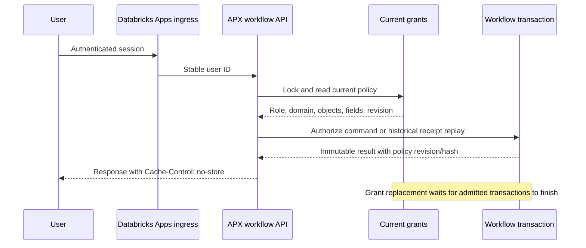

# Workflow authorization boundary, version 1

This Phase C / LM-008 increment connects the APX HTTP routes to current,
server-owned PostgreSQL grants and the transactional workflow worker. It preserves
APX 0.3.8, the frozen role policy and existing review/label receipts. The default
review app has no mastering backend attached and refuses mastering requests.



The diagram describes the intended deployed ingress plus the implemented API
and database boundary. Local tests simulate the platform envelope; they do not
prove real workspace authentication, header sanitization, ingress isolation or
Lakebase OAuth. Those remain deployment qualification gates.

## Identity and application assembly

The new routes require `DATABRICKS_APP_NAME`, an explicit platform-injected
`DATABRICKS_WORKSPACE_ID`, and exactly one valid `X-Forwarded-User` header. The
principal is `databricks:<workspace ID>:<stable user ID>`. Preferred username,
email and browser-supplied role headers do not determine authorization. Local
review identity is never accepted as a mastering identity. Request bodies forbid
actor, role, grant and context overrides.

This relies on Databricks Apps ingress authenticating the session, replacing
identity headers and being the only network entry to the application. Setting
an environment marker alone is not authentication. Do not expose this handler
behind an untrusted proxy or enable its platform markers for ordinary local
clients. For off-platform deployment, provide a separately verified identity
dependency. No user token is logged, cached or replaced with service-principal
credentials in this boundary.

References: [Apps HTTP headers](https://docs.databricks.com/aws/en/dev-tools/databricks-apps/http-headers)
and [Apps authorization](https://docs.databricks.com/aws/en/dev-tools/databricks-apps/auth).
Unity Catalog user delegation is separate from authorization of these app-owned
workflow tables; this implementation does not add UC queries or OAuth scopes.

An explicit deployment entrypoint assembles the components:

```python
from lakematch.mastering.workflow_api import WorkflowAPI
from lakematch.mastering.workflow_contract import WorkflowContext
from lakematch_review.backend.app import create_review_app

# Supply a fresh connection factory using a dedicated restricted database role.
# Choose and validate the domain definition/version/digest in deployment config.
api = WorkflowAPI(connect, [WorkflowContext(domain_id, domain_version, domain_sha256)])
app = create_review_app(api)
```

`connect` and the context values above are required deployment bindings, not
defaults. The optional worker assembly runs on Python 3.12 with the root worker's
PostgreSQL/YAML dependencies. The ordinary APX package remains independent of
Spark and imports no engine module. Clean remote packaging of the combined
entrypoint, Lakebase project/branch/database selection, OAuth renewal and app
service bindings are still pending. There is no automatic localhost database,
default workspace/profile or permissive grant fallback.

## Policy storage, revocation and audit

Migration `0006_access.sql` adds a stable subject-lock row, current grant policy
and append-only policy events. `PostgresAccessRegistry.replace` is an operator
interface with actor/reason/key attribution, optimistic revisions and exact
receipt replay. Empty grants revoke access. This interface is not exposed over
HTTP. Initial grants must be installed by the designated policy operator; the
ordinary application database role cannot create or modify grant policies/events.

Every request reads an intact current policy and its immutable event under a
subject share lock. A policy replacement/revocation takes the exclusive lock.
An already admitted transaction may finish before revocation commits; subsequent
requests observe the new policy. Policy state is not cached. Supported operator
changes must use the registry so the lock protocol is honored; a database owner
remains trusted and can bypass database controls.

Authorization runs **before receipt lookup**, in the same business transaction.
Revoked users cannot retrieve a previously successful result by retrying its
key. Regranting permits an otherwise authorized retry to return its original
receipt. New authorized command receipts include an immutable `authorization`
envelope with principal, access-policy version, revision and definition hash.
Historical receipts keep their original proof; current access is checked again.
The trusted internal worker's prior receipt shape remains unchanged.

## Roles and scopes

The immutable Phase A role evaluator is reused without modification.

| Workflow action | Viewer | Steward | Approver | Engineer | Administrator |
|---|---|---|---|---|---|
| Read task/operation/history/inbox | Yes | Yes | Yes | Yes | Yes |
| Create task or propose | No | Yes | No | No | Yes |
| Claim/renew/release/cancel | No | Yes | No | No | Yes |
| Approve another actor's proposal | No | No | Yes | No | Yes |
| Approve own proposal | No | No | No | No | No |

Each permission also requires the correct domain and access to **every**
participating company. Scoped grants never authorize a whole merge merely
because one participant is visible. Role grants for another domain have no
effect. The service checks object scopes for task, operation and history reads
and filters inbox rows in SQL before applying pagination. It returns no hidden
IDs, totals or cursor positions.

Workflow evidence and reasons are unstructured JSON/text and can contain any
business field. Version 1 therefore requires a grant covering all fields in the
bound domain for raw workflow access. A partial field grant is denied; fragments
from different grants are not combined into full field access. This is a
conservative supported contract, not a claim that field-level entity/provenance
projection has been implemented. That projection remains an LM-010/008 gate.

Inboxes/history use up to 100 rows. Cursors bind the principal, workflow context,
query, access revision and access-definition hash. A grant replacement invalidates
earlier cursors. Cursors are validated query positions, not authorization tokens.
Pages represent a live queue, not a multi-page snapshot. HTTP responses on the
new API, including denials, use `Cache-Control: no-store`.

## Routes and failure behavior

All new routes start at `/api/v1/domains/{domain_id}`. The generated APX client
includes their schemas and operation IDs.

| Route | Behavior |
|---|---|
| `POST /tasks`, `GET /tasks`, `GET /tasks/{id}` | Create, scoped inbox and task detail |
| `POST /tasks/{id}/claim`, `/renew`, `/release`, `/cancel` | Fenced lease/state commands |
| `POST /tasks/{id}/propose` | Validated pending intent; no business apply |
| `GET /operations/{id}`, `POST /operations/{id}/approve` | State and independent approval |
| `GET /tasks/{id}/history`, `GET /operations/{id}/history` | Scoped immutable command history |

Mutations require one nonblank `Idempotency-Key`, a reason, appropriate revisions
and a lease token where applicable. Unknown body fields are rejected. Request
bodies are capped at 64 KiB before framework parsing; duplicate JSON keys,
nonfinite numbers and excessive nesting/nodes are rejected. The worker's tighter
intent/evidence limits still apply.

Missing identity returns 401; denied roles/fields return 403; inaccessible or
absent objects/domains return the same generic 404; conflicting commands return
409; invalid typed requests return 422; malformed bounded JSON returns 400 and
oversized bodies 413. Missing backend, unavailable policy integrity or database
failures return generic 503. Database details and hidden object evidence are not
returned. Denials do not create successful command receipts or workflow effects.

## Database role boundary

`grant_workflow_role(connection, role)` is an explicit operator installer for
a pre-created dedicated role. It rejects owners, elevated roles, memberships and
pre-existing broad privileges. It grants only the supported workflow table and
sequence operations, plus read access to the domain/identity/policy data needed
for validation. Grant changes, identity mutation, schema creation, truncation
and receipt/audit rewrites are excluded.

PostgreSQL requires UPDATE privilege on at least one column for row share locks.
The role receives UPDATE only on the immutable domain key for identity, domain
and subject tables. Existing/additive triggers reject actual key updates, and
the role cannot advance identity or domain revisions. Tests execute the full
HTTP workflow using this nonowner role and verify prohibited SQL operations fail.

These are service-role SQL privileges. The shared backend still has broader
read access than an individual user and must enforce its API policy. This is
**not per-user RLS**, UC policy inheritance or a defense against a compromised
backend identity. Per-user RLS/role binding, other future entity/search/graph/cache
paths and real revocation behavior in the deployed app remain LM-008 gates.
Existing `/api/reviews` and synthetic demo routes retain their prior contracts;
this checkpoint does not relabel them as fully governed MDM APIs.

## Verification

[Slot-2 plan](../../bench/lakefusion/ACCESS_PLAN.md) declares the experiment before
execution. `tools/run_mastering_http_tests.py` builds a fresh app wheel, installs
it into an owned Python 3.12 runtime from the frozen app lockfile, and runs both
app regressions and real HTTP/Postgres checks. Installed imports and the transport
source hash are verified. All PostgreSQL instances use private Unix sockets and
stop after testing. The helper uses offline dependency caches; prepare those
explicitly with `uv sync --project app --frozen` and a separate Python 3.12 app
environment plus `requirements-postgres.lock` and `PyYAML==6.0.3` when needed.
