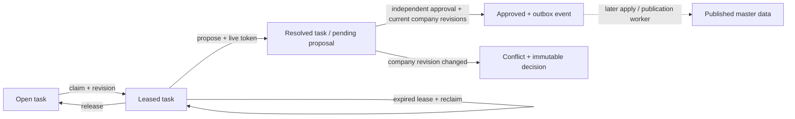

# Transactional stewardship worker, version 1

Phase C / LM-007 introduces tasks that can be claimed by one steward, proposed
changes that require an independent approver, and immutable command receipts.
The optional `PostgresWorkflow` adapter uses PostgreSQL transactions. It is an
internal worker service; authenticated application routes and Lakebase deployment
are still required before customer use.

## Calls and data ownership

`PostgresWorkflow(connect, WorkflowContext(domain_id, domain_version,
domain_sha256))` takes a factory for fresh owned psycopg connections. The optional
root `postgres` extra supplies the driver. It does not change the Spark engine,
the packaged APX demo, or the legacy SQLite/Delta label receipt contracts.

Every mutation requires `actor`, `reason` and `key`. Actors are stable IDs from a
trusted caller; there is no login, role lookup or user impersonation mechanism
in this module. LM-008 must authorize every new command, retry and read before
calling it. No connection credentials, grants, RLS policies or remote resources
are installed by this implementation.

| Call | Required concurrency inputs | Outcome |
|---|---|---|
| `create_task(kind, entity_ids, evidence=..., priority=...)` | Exact approved domain context | New open task and original creation receipt |
| `claim(task_id, expected_revision, seconds=...)` | Open task or expired claimed task | Current assignee, new token, deadline and next revision |
| `renew(task_id, expected_revision, lease_token, seconds=...)` | Current live owner and token | New token, deadline and next revision |
| `release(task_id, expected_revision, lease_token)` | Current live owner and token | Open task, cleared lease and next revision |
| `cancel(task_id, expected_revision, lease_token=...)` | Open task, or current live owner | Terminal canceled task |
| `propose(task_id, expected_revision, lease_token, versions, payload, evidence=...)` | Current live owner; exact task entities and company revisions | Resolved task, pending operation, immutable decision and receipt |
| `approve(operation_id, expected_revision)` | Pending operation; actor differs from proposer | Approved operation and one outbox event, or durable revision conflict |
| `get_task`, `get_operation`, `inbox`, `history` | Explicit domain/version/digest | Bounded worker views; application authorization still required |

Postgres owns these operational rows. Delta remains the authority for published
master data. A resolved task means its proposal was recorded. An approved
operation means an independent actor accepted that intent. Neither state means
that the identity, golden record or published snapshot has changed.

## Retry, concurrency and recovery contract

The idempotency scope is `(actor, key)` across domains and actions. A canonical
request binds the workflow/domain context, action, arguments, actor and reason.
Object-key ordering and task entity ordering are canonical; ordered arrays in
submitted evidence remain part of the exact request. Reusing a key with any
different bound input raises `WorkflowConflict`.

A transaction advisory lock serializes each actor/key before receipt lookup.
The service validates the saved request and receipt hashes before replay and
looks for an existing receipt before testing current revisions, leases or domain
approval. Retries therefore return the original saved result even after renewal,
approval, expiry or domain retirement. A historical claim receipt does not grant
a fresh lease; use `get_task` to inspect current state. Authorization must still
be checked by the eventual API on every retry.

New commands require an approved domain definition and its immutable registry
approval event. Task/operation row locks serialize revisions, and sorted company
share locks coordinate proposal/approval with identity changes. All mutations
advance the affected task or operation revision exactly once. Only the current
live owner/token may renew, release or propose; renewal/reclaim rotates the token.
Database `clock_timestamp()` is read after task locking, and proposal rechecks
the lease after waiting for company locks. An expired owner must reclaim using
the current revision and a new command key.

Task resolution, operation insertion, decision insertion and the command receipt
commit together. Approval similarly commits its decision, operation state,
outbox event and receipt together. A stale company produces a saved `conflict`
receipt and decision with no outbox event. Invalid ownership, self-approval,
stale task/operation revisions or malformed requests raise and roll back; they
do not create successful-command receipts. Future API audit may record denials
separately without treating them as accepted commands.

The outbox kind is `workflow.approved.v1`, unique per operation. It carries the
operation ID/revision, intent hash, workflow context and approval decision ID.
LM-009/011 must implement delivery, application-time authorization/business-policy
and revision rechecks, recovery and publication acknowledgements. An approval
is not a reservation against later company edits.

Each transaction has a 5-second lock timeout and 15-second statement timeout.
There are no hidden retries: callers may retry transient errors with the exact
key/request. A crash before commit rolls everything back; a lost response after
commit is reconciled by replaying the original command.

## Bounded intents and reads

The initial kinds are `merge` (explicit participating survivor), `override`
(one domain-valid scalar field/value), `split_new` (explicit source members) and
`restore_merge` (original identity merge event ID). Merge/restoration tasks bind
2–32 company identities; override/split bind one. Proposals verify current
identity state and revision; restoration permits merged participants. Full
business preview, membership reconciliation, merge-event validation, cross-field
checks and conflict resolution are LM-011 work. A syntactically valid proposal
does not prove those business checks have passed.

Lease duration is 1–900 seconds; priority is an integer from -1000 to 1000.
Evidence/intent objects are limited to 32 KiB, complete requests to 64 KiB,
JSON depth to 8 and nodes to 4096. Actor/key are at most 512 UTF-8 bytes and reasons
4096. Null bytes, nonfinite JSON numbers and malformed UUIDs are rejected.
Receipts use UTC timestamps independent of the PostgreSQL session timezone.

Inbox order is priority descending, then task UUID ascending; each query selects
one task state. History selects exactly one task or operation and orders saved
commands by sequence. Both return up to 100 items and a context/filter-bound
keyset cursor. Cursor binding detects accidental cross-query reuse; it is not
an authorization token or tamper-proof signature. Each page is a consistent
database read, but multiple pages observe a live inbox rather than one frozen
snapshot. Concurrent state changes can move tasks between inboxes.

## Additive migration and compatibility

Apply `0005_workflow.sql` through the existing transactional, checksummed
`apply_migrations` runner. Do not edit applied migrations or downgrade schema
history. The migration adds workflow columns, indexes, command receipts and
transition/immutability guards. Historical task/operation rows remain
`workflow_schema=0`, retaining their original update behavior. Their added task
`created_at` is the migration timestamp, not reconstructed historical provenance.
The new service refuses to reinterpret these rows. New managed rows explicitly
use schema 1; ordinary updates cannot change that marker.

Managed task definitions, operation intent, approvals, decisions and command
receipts are immutable under ordinary row updates/deletes. These checks are
data integrity controls; a database owner can disable triggers. Restricting the
actual application/worker roles, table privileges and caches remains LM-008.
The migration grants no access and does not install an outbox consumer.

The local acceptance plan is [WORKFLOW_PLAN.md](../../bench/lakefusion/WORKFLOW_PLAN.md).
Local PostgreSQL results do not establish Lakebase OAuth renewal, database grants,
deployed app identity, remote migration, authenticated roles or UI behavior.
