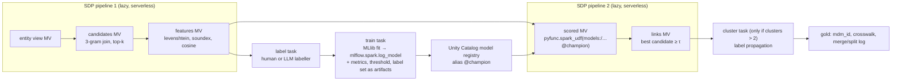

# Zingg on MLflow + Spark Declarative Pipelines / Lakeflow: adapt, or rewrite?

*Position paper, 2026-09-19. Question from Laurent: what is easier — adapting the existing Zingg, or rewriting in Zig
or Python — to run on MLflow and SDP/Lakeflow pipelines, and can it be done with no dependency beyond Databricks'
open-source libraries? Facts are marked [measured] (checked in this session, with the source) or [claim] (my
reasoning or recollection, to be challenged). Reviewed by Codex on gpt-6-astra: see the last section.*

## Answer (revised after Codex / gpt-6-astra challenged the first draft — its full text: `PORTING_ASTRA_OPINION.md`)

**It depends on one constraint, and for Laurent's stated constraints the answer is: rewrite in PySpark.**

| If the hard requirements are… | Easiest credible path | Effort (Astra's estimate, person-weeks, production-grade) |
|---|---|---|
| serverless / Free Edition, **or** "nothing but Spark + Delta + MLflow", **or** matching *inside* SDP flows | **B. PySpark rewrite** of the architecture that won the benchmarks | 16–28 |
| a paid workspace with classic compute, and the dependency rule is negotiable | **D. Thin adapter first** (Astra's pick): Zingg's JAR as a Lakeflow Job task, SDP tables in and out, the complete model bundle in MLflow; replace components later, one at a time, behind a controlled benchmark | 6–10 |
| a dependency-free matcher for the lake on the Mac (not Databricks) | Zig is legitimate there — a different project | not estimated |
| a distributed Zig engine for Databricks | no | 32–52+ |

Laurent asked for "no dependencies other than Databricks OSS libraries", and all four of his workspaces are Free
Edition (serverless only, no Scala): both conditions select **B**. Astra's own report says the same: *"If Free
Edition/serverless and eliminating Zingg dependencies are hard requirements, my recommendation changes to B."* The
platform facts it could not check offline were verified against the documentation (below).

Where Astra was right and the first draft wrong:
- "Adapting cannot meet the target" was too categorical. The thin adapter is real: Zingg saves a standard Spark
  `CrossValidatorModel` (`SparkModel.java:136`). It is "Zingg next to Lakeflow", and on classic compute that is a
  perfectly good answer and the cheapest one.
- But "log the Spark model" is not enough: the similarity features sit **outside** the saved classifier, the blocking
  tree is a Java-serialized object inside Parquet, `zinggDir/preprocess` is shared state, and `z_cluster` is not a
  durable identity. The bundle to version is config + feature order + similarity code + tree + classifier + labels.
- The benchmarks do **not** justify discarding Zingg's learned blocking: they never isolated blocking as its
  bottleneck. Keep it as a baseline; an intermediate option is to export the learned tree as SQL rules.
- Two of Zingg's similarity functions have no Spark built-in: its "Jaro-Winkler" (actually SecondString **Jaro**) and
  its "affine gap" (actually **Monge-Elkan**). Everything else — and every hash function — is SQL-composable, but exact
  parity is work (missing strings score 1, "only alphabets" strips digits and dots, Java rounding).
- "No dependency" needs a definition: PySpark itself imports NumPy, pandas and Arrow. The defensible goal is **no
  additional third-party matching engine beyond the platform stack**.
- Licensing belongs in the decision: adapting keeps the **AGPL v3** obligations; a clean-room rewrite does not.
- Not analysed by the first draft and still open: durable entity identity vs pair prediction; deletes, corrections,
  late records and rematching; model provenance and session-bound model references in SDP; cost, skew and recovery at
  10^7 records; multi-valued fields and Unicode.

| Option | Runs in an SDP flow | Serverless / Free Edition | Only Spark + Delta + MLflow | Quality measured |
|---|---|---|---|---|
| A/D. Zingg as a JAR task | no (next to it) | no: pipelines forbid JVM libraries; Free Edition has no Scala | no (GraphFrames, SecondString, FreeMarker, JavaMail; AGPL) | F1 0.84–0.86 on the harder FEBRL4 task |
| B. PySpark rewrite | yes for candidates, features, scoring, links; not `fit` nor convergence loops | yes | yes | **F1 0.96–0.98**, robust to the checks below |
| C. Zig on Databricks | no | no | no | not applicable |

## Facts about the existing Zingg [measured, v0.7.0 + `main` on 2026-09-19]

- **Size and layering.** 19 000 lines of Java/Scala + 1 400 of Python. `common/*` (14 200 lines) never imports Spark:
  everything goes through a `ZFrame<D, R, C>` abstraction. Only `spark/*` (4 600 lines, 84 of 110 files) touches Spark.
- **How Python reaches it.** `python/zingg/client.py` takes `SparkContext._jvm` through py4j and drives Java objects.
  There is no `_jvm` under Spark Connect.
- **Row-level logic is Java UDFs.** Similarity functions (`SparkSimFunction implements UDF2`), hash/blocking
  functions and stop-word removal are registered with `sparkSession.udf().register(...)`. They need the Zingg JAR on
  the executors.
- **Classifier.** Plain Spark ML: `VectorAssembler → PolynomialExpansion → LogisticRegression` under a
  `CrossValidator`. This part is portable as is.
- **Clustering.** GraphFrames `connectedComponents()`.
- **Bundled third-party code in the fat jar:** GraphFrames, SecondString (`com.wcohen.ss`, string similarities),
  FreeMarker (model documentation), JavaMail, Apache Commons, Jackson. None is a Databricks or Apache Spark library.
- **Upstream is moving to Spark Connect, the server-side way.** Since v0.7.0: PR #1350 (11 Aug) and #1376 (22 Aug) add
  `ZinggCommandPlugin` and `ZinggRelationPlugin`, registered with
  `spark.connect.extensions.command.classes` / `.relation.classes`, plus a protobuf module; #1382 replaces one Java UDF
  with native `regexp_replace`. That design requires owning the Connect **server's** configuration and installing the
  JAR on it.

## Facts about the target [measured in PySpark 4.1.3 source unless marked]

- **An SDP flow function may only build a lazy plan.** While flows are defined, `pyspark/pipelines/
  block_connect_access.py` blocks the `ExecutePlan` and `AnalyzePlan` RPCs (only `spark.sql` commands pass), and
  `block_session_mutations.py` blocks `RuntimeConf.set`, `setCurrentCatalog/Database`, temp-view creation and **UDF
  registration**. So inside a flow there is no `.fit()`, `.count()`, `.collect()`, no loop-until-convergence, and no
  `spark.udf.register`.
- **Spark ML works over Spark Connect in 4.1** (`pyspark/ml/connect/`, `try_remote_fit` throughout `pyspark.ml`), so
  MLlib training is possible from a Connect client — in a job task, not in a flow.
- The open-source `pyspark.pipelines` exposes `table`, `materialized_view`, `temporary_view`, `append_flow`,
  `create_streaming_table`, `create_sink`; no expectations API (Databricks-only).
- **Empirical probes, open-source SDP 4.1.3, run locally** (`spark-pipelines run`) [measured]:

  | Inside the flow function | Result |
  |---|---|
  | `df.count()`, `df.columns`, MLlib `fit` | refused: `ATTEMPT_ANALYSIS_IN_PIPELINE_QUERY_FUNCTION` |
  | `@F.udf` / `@F.pandas_udf` applied to a column | run COMPLETED |
  | MLlib model fitted or loaded at MODULE IMPORT, `model.transform(df)` inside the flow | run COMPLETED |
  | the prototype's blocking as two materialized views | run COMPLETED, 9 s on 800 × 800 records |

  So the block is active only while the flow function is evaluated; scoring with a Spark ML model loaded at import
  works lazily in a flow. Training and loop-until-convergence do not.
- **Databricks platform, verified against the documentation on 2026-09-19** (pages dated 2026-09-11):
  - Pipelines: "pipelines support only SQL and Python. You cannot use JVM libraries in a pipeline."
    (docs.databricks.com/aws/en/ldp/developer/external-dependencies). Dataset code must never call `collect()`,
    `count()`, `toPandas()`, `save()`, `saveAsTable()`, `start()`, `toTable()` (…/ldp/developer/python-ref). UDFs and
    MLflow models are explicitly allowed; the documented scoring pattern is `mlflow.pyfunc.spark_udf`, and a Unity
    Catalog pipeline needs the preview channel for MLflow models (…/ldp/transform).
  - Serverless: no Scala/R in notebooks, no compute-scoped libraries or Spark extensions, only six Spark confs
    settable (so no `spark.connect.extensions.*`); `cache()`, `persist()` and `checkpoint()` raise; UDFs cannot reach
    the internet (…/compute/serverless/limitations, …/spark/conf). **Correction to my first draft: serverless JAR
    *tasks* in jobs ARE supported from environment version 4** — as Spark Connect clients with Spark provided
    (…/jobs/jar); that does not admit a JAR that needs server-side Java UDFs and its own session.
  - Spark ML: "The pyspark.ml package … is supported on serverless, standard, and dedicated compute"; serverless
    environment v4 caps a model at **100 MB** (1 GB of models per session) and also supports `mlflow.spark`; standard
    access mode needs DBR 17.0+ (1 GB per model). Saving a Spark ML model there needs a UC volume path
    (`MLFLOW_DFS_TMP`, from MLflow's source). `CrossValidator` works over Connect (SPARK-50940).
  - Free Edition: serverless only, no R or Scala, outbound internet restricted to trusted domains — **unlockable with
    LinkedIn verification** (…/getting-started/free-edition-limitations).
  - GraphFrames: "maintained by a group of individual contributors" (its README); bundled only in Databricks Runtime
    ML; its Connect path needs a server plugin, so not on serverless.
  - Open-source SDP has no expectations, AUTO CDC or event log; Lakeflow adds them
    (…/ldp/concepts/spark-declarative-pipelines).

## Why A (adapt) loses

1. It cannot enter an SDP flow: Zingg is a program that reads and writes pipes and triggers actions; a flow is a
   function returning a lazy DataFrame. Upstream's Connect work does not change that.
2. It cannot run in a pipeline (JVM libraries are forbidden there) nor on Free Edition (no Scala, serverless only).
   Serverless jobs accept JAR tasks only as Spark Connect clients, which Zingg's Java UDFs and server plugins are not. It can run as a **Lakeflow Job task
   on a classic cluster** (JAR or spark-submit), with SDP pipelines before and after it. That is "Zingg next to
   Lakeflow", not "Zingg on SDP".
3. It fails the dependency rule four times over (GraphFrames, SecondString, FreeMarker, JavaMail).
4. Making it fit means rewriting exactly the 4 600 Spark-specific lines plus every UDF as native expressions — i.e. a
   rewrite, in Java, of the parts that matter, while carrying 14 000 lines of abstraction whose purpose (engine
   independence: Spark, Snowflake…) the target does not need.
5. The benchmarks give no reason to preserve its design: under default settings its learned blocking + classifier
   recovered 73–76 % of true links on FEBRL4 (F1 0.84–0.86), where nearest-neighbour candidates + a small classifier
   reached 0.96–0.99.

## Why C (Zig) loses for this target

Zig produces native code. SDP flows are Python or SQL; serverless does not load native libraries; MLflow has no Zig
flavour. Zig is the right tool for a *different* target — a dependency-free local matcher over Parquet next to DuckDB
on the Mac, which is where the lake actually lives — but that is not "MLflow and SDP/Lakeflow".

## Why B (PySpark rewrite) wins — with evidence [measured]

`bench/proto_spark_native.py`: about 90 lines of matching code, **only Spark SQL built-ins and Spark MLlib** (no
scikit-learn, no GraphFrames, no JAR, no Python UDF; NumPy and `recordlinkage` are imported only to load the benchmark
and remove partners). FEBRL4 with half the partners removed (2 500 links, 2 500 anchors to reject):

| Fields | nearest neighbour alone | **PySpark-native: SQL blocking + SQL features + MLlib GBT (400 labels)** | scikit-learn pipeline (classifier only) | Zingg, perfect labels |
|---|---|---|---|---|
| all ten | 0.667 | **0.978** (P 0.997, R 0.961) | 0.975 | 0.841 |
| SSN hidden | 0.667 | **0.978** (P 0.989, R 0.966) | 0.936 | 0.862 |
| SSN + birth date hidden | 0.667 | **0.965** (P 0.995, R 0.937) | 0.983 | not run |

13–20 s of compute, 16–22 s wall including Spark start-up (the first draft's "14 s including start-up" was wrong: the
timer started after the session existed). Labels here are ground truth for 400 sampled pairs (Jev's confident labels
were 100 % correct on this data, 2 173 of 2 173, so this isolates "is Spark-native code good enough").

**Fairness checks demanded by the review** (SSN hidden; `--labels`, `--cap` flags) [measured]:

| Objection | Test | F1 |
|---|---|---|
| training pairs are among the scored pairs | score held-out anchors only | 0.9739 (all anchors: 0.9745) |
| best-per-anchor lets two anchors claim one partner | 31 such cases; keep each partner's best anchor | 0.9760 |
| 400 gold labels vs Zingg's ≈ 120 | 120 labels (10 matches) | 0.982; 0.996 with one-to-one enforced |
| the gram cap (400) is unexplained | caps 200 / 400 / 800 / none | 0.966 / 0.975 / 0.964 / 0.960 |

So quote **0.96–0.98**, not a best figure. Still unequal: Zingg chooses its own pairs by active learning while the
prototype labels a random sample of candidates; the retrieval score is a frequency-masked gram overlap with unmasked
norms, not true cosine and not the TF-IDF of `bench_pipeline.py`; and FEBRL4 is synthetic and one-to-one.
**Scale is untested**: top-k is applied after the gram join, whose size is Σ n_A(g)·n_B(g); at 10^7 records this needs
selective field blocks plus a partitioned rare-gram index with explicit candidate budgets and measured recall
(MinHashLSH is a candidate, not a guarantee).

- **Blocking** = character 3-grams (`sequence` + `transform` + `substring`), explode, join on shared grams, cosine on
  gram sets, `row_number()` top-k. All lazy SQL → a materialized view.
- **Features** = `levenshtein`, `soundex`, equality, gram cosine, rank, gap. All built-ins → a materialized view.
- **Matcher** = MLlib `GBTClassifier` (or `LogisticRegression`). `fit` runs in a job task; log with `mlflow.spark`.
- **Scoring** = `model.transform` is lazy and works inside a flow for a model loaded at import [measured, OSS SDP];
  on Databricks the documented pattern is `mlflow.pyfunc.spark_udf`, and `mlflow.spark` models always carry a pyfunc
  flavour. Keep the model under 100 MB on serverless.
- **Clustering** = for pairs (one-to-one linkage) nothing is needed. For clusters > 2: connected components by
  min-label propagation with DataFrames, in a job task (it needs a convergence test, hence actions), or a fixed number
  of unrolled rounds inside a flow. On serverless `checkpoint()` and `cache()` raise, so each round must be written to
  a Delta table instead.

## Proposed shape on Lakeflow

A Lakeflow Job orchestrates: pipeline 1 → label → train → pipeline 2 → cluster. MLflow holds the model, the
labelled pairs it was trained on, precision/recall on the human EVAL sample, and the threshold.

## "No dependency other than Databricks OSS libraries" — can it?

**Yes for B**, taking "Databricks OSS" as Apache Spark (incl. MLlib), Delta Lake, MLflow and Unity Catalog:

| Need | Provided by | Note |
|---|---|---|
| blocking, features, top-k, clustering | Spark SQL / DataFrame | no UDF at all in the prototype |
| classifier | Spark MLlib | `GBTClassifier` / `LogisticRegression` |
| model registry, lineage, metrics | MLflow (+ UC) | `mlflow.spark`, `pyfunc.spark_udf` |
| storage, time travel, merge/split log | Delta Lake | |
| Jaro-Winkler, TF-IDF weighting | not built in | not needed to reach 0.97; TF-IDF weighting is expressible in SQL (df per gram) |
| LLM labeller / judge (Jev) | **not OSS, not Databricks** | optional; on Databricks the in-platform substitute is `ai_query`, which is not OSS either. Free Edition's restricted egress likely blocks the TypeSafe API [claim] |

**No for A** (GraphFrames, SecondString, FreeMarker, JavaMail, and the JAR itself).

## What I am least sure of (please attack these)

1. Whether `mlflow.pyfunc.spark_udf` is permitted inside an OSS SDP flow given `UDFRegistration` is blocked, and
   whether a Spark ML model (not a Python model) can be applied lazily in a flow on serverless.
2. Whether Spark MLlib is fully usable on Databricks serverless / Free Edition today.
3. Whether the 3-gram self-join scales: the prototype drops grams present in > 400 records; at millions of records
   this needs IDF-weighted pruning or MinHashLSH (MLlib), whose `fit` is again an action.
4. Whether dismissing Zingg's active-learning loop and learned blocking tree throws away something the benchmarks
   did not measure (they ran Zingg on default settings; FEBRL4 is synthetic and one-to-one).
5. Whether "adapt" is unfairly framed: a thin path — keep Zingg as a JAR job task on classic compute, publish its
   output through SDP, log its Spark ML model to MLflow — may be *easier* than any rewrite if SDP-native is not a hard
   requirement.
6. Effort: "110 lines" is a prototype without labelling UI, incremental matching, stable ids, merge/split
   reconciliation, multi-valued fields, or clusters larger than two.
