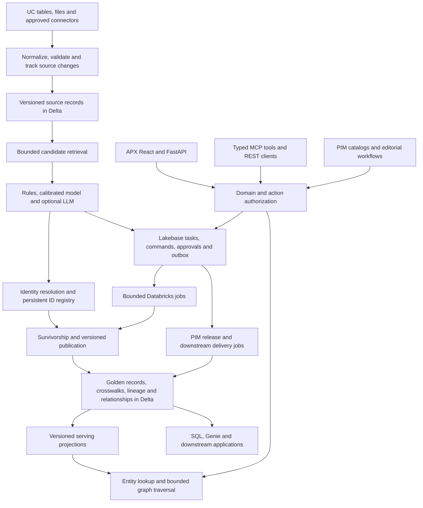

# Implementing LakeFusion-level capabilities in Lakematch

This is a proposed design, not implemented functionality. It follows the
[public assessment](README.md); source IDs resolve in [SOURCES.md](SOURCES.md).
Keep the existing Apache-2.0 engine independent of the APX application and
optional Databricks services. Build original workflows and interfaces rather
than copying vendor code, screens or proprietary rules.

## 1. Target architecture and ownership



**Delta/Unity Catalog owns** source histories, published master snapshots,
attribute lineage, memberships, approved relationships, model-input snapshots
and durable analytic audit data. **Lakebase owns** task leases, user commands,
approval state, transactional identity allocation, PIM drafts and delivery
outboxes. **Serving projections** are rebuildable derivatives with explicit
source versions and freshness. Each datum has one authoritative writer;
two-way synchronization of the same writable table is not the design.

The portable implementation can use SQLite for small single-user acceptance
fixtures and ordinary Postgres for transactional integration tests. Lakebase
is the recommended Databricks operational adapter, not a requirement imported
into every engine run. Start with source tables already in UC; reuse Lakeflow
Connect when an external connector is actually required. [D03, D15]

## 2. Canonical model: minimum useful tables

Every business object needs a domain/namespace. Distinguish a source key from a
master ID, a model version from a ruleset version, business-effective time from
observation time, and a draft operation from a committed publication.

| Logical table | Important fields / keys | Owner and purpose |
|---|---|---|
| `domain_version` | `domain_id, version, schema, identity_granularity, ruleset_id, state` | Postgres control plane; approved definitions exported with each job |
| `source_mapping_version` | `source_id, domain_id, version, source_schema_digest, mapping, transforms, approved_by` | Reusable import contract, including nested field paths |
| `source_record_version` | `domain_id, source_id, source_key, source_sequence, payload, payload_hash, event_time, observed_at, deleted` | Delta append/history; deterministic ingestion identity |
| `master_identity` | `domain_id, master_id, created_at, status, revision` | Postgres allocation and concurrency; published in Delta snapshots |
| `identity_event` | `event_id, operation_id, event_type, prior_ids, resulting_ids, reason, actor, event_time` | Append-only allocation/merge/split/rekey history |
| `membership_version` | `publication_id, source_id, source_key, master_id, effective_from, effective_to` | Delta crosswalk; aliases resolve retired IDs |
| `match_evidence` | `pair_id, record_version_hashes, candidate_methods, feature_contract, model_uri, score, band, reason, ruleset_id` | Delta matching evidence; separate LLM metadata where applicable |
| `golden_record_version` | `domain_id, master_id, revision, publication_id, payload, valid_from, valid_to, quality_status` | Immutable published master versions |
| `golden_attribute_lineage` | `master_id, revision, field_path, value_hash, source_record_versions, policy_id, override_event_id, reason` | Why each scalar or nested value was published |
| `steward_task` | `task_id, domain_id, kind, entity_ids, state, assignee, lease_until, revision, priority` | Postgres operational inbox |
| `steward_decision` | `decision_id, task_id, actor, action, reason, expected_revision, supersedes, evidence` | Immutable decisions; corrections append a superseding event |
| `operation` + `outbox_event` | `operation_id, caller, idempotency_key, payload_digest, expected_versions, state, event_id, delivery_status` | Transactional intent and at-least-once delivery; unique caller/key pair |
| `reference_value_version` | `reference_domain, code, version, parent_id, aliases, effective_from, effective_to, status` | Governed code lists and dependent-value validation |
| `relationship_version` | `edge_id, from_id, to_id, type, attributes, effective_from, effective_to, source, approval_state` | Business edges; not a reuse of duplicate-match edges |
| `publication` | `publication_id, state, schema/model/rule versions, table_versions, command_watermark` | One coherent release manifest/pointer |
| `projection_status` | `projection_id, publication_id, source_versions, completed_at, policy_version, status` | Freshness and authorization contract for search/graph caches |

Use real transactional unique constraints in the workflow database. Delta
primary/foreign/unique declarations are informational and do not enforce
uniqueness. Multi-statement Databricks transactions are now documented, but
require eligible UC tables, Catalog commits and supported compute. They do not
create a transaction spanning Postgres, Delta, AI Search and webhooks. Preserve
the existing immutable-snapshot publisher until a capability-tested migration
justifies changing it. [D08–D09; E06]

Export operational decisions to the analytic audit store through a versioned,
replayable outbox consumer. Lakebase-to-Delta change data feed is an optional
transport currently documented as **Public Preview**; capability-test it before
adoption and retain a checkpointed export path. Replication does not replace
the immutable business decision events or publication acknowledgements. [D16]

### Identity and survivorship rules

Allocate a persistent master ID once. A merge retains an explicitly selected
survivor and records redirects; a split records whether an old identity is
restored or a new one is created. Replaying a command returns the same outcome.
Adding an earlier-sorting source key must not implicitly change the public ID.
Keep historical benchmark IDs and their policy version readable.

Make business granularity explicit: a legal company, a corporate family and a
physical branch are not interchangeable entities. Product family, variant and
SKU likewise have different identities.

Start survivorship with ordered scalar rules: an approved steward override,
verified-source precedence, quality/freshness criteria, then a deterministic
tie-breaker. Preserve null semantics and conflicting values. Extend to
array union/deduplication and nested reference IDs only after typed schemas are
in place. Arrays of structured addresses must preserve each address tuple;
independent field-wise selection can invent an address never present in a source.

Record each winning value's source versions, policy and decision. An AI-generated
description is an attributed proposal, never an unlabelled source fact. [LF04,
LF08; D10]

## 3. Matching roadmap: coverage, calibration, selective AI

1. **Coverage:** profile missingness and languages; normalize legal suffixes,
   identifiers, phones, units and dates with domain-specific rules. Union exact
   identifier blocks, lexical retrieval and measured semantic retrieval. Retain
   a reason/method per candidate. Measure candidate recall against known positives
   before fitting another classifier. Audit each cap and top-k truncation.
2. **Deterministic decisions:** separate identity match rules from candidate
   blocks. Exact same-source duplicate handling, strong unique identifiers,
   explicit incompatibilities and business granularity need versioned precedence.
   A blocking-key agreement alone is not evidence sufficient for auto-merge.
3. **Probabilistic scoring:** retain existing GBT/RF/logistic choices. Compare on
   the same declared development split. Calibrate probabilities using held-out
   development data; log calibration error/Brier score as well as F1. Choose
   reject/review/accept thresholds from error costs and confidence intervals,
   not a universal default of 0.5. [D19]
4. **Explanations:** first display actual comparison values, missing fields,
   matching rules and retrieved sources. Evaluate TreeSHAP for the chosen model
   and runtime; PySpark support does not guarantee every model/output mode works.
   Record the explainer/background version, output scale and additivity check.
   A contribution explains a model output, not the causal truth of an identity.
   [D20]
5. **Optional LLM:** submit only uncertain, policy-permitted pairs. Require a
   structured `match/no_match/unsure` response with evidence fields; allow abstention.
   Cache by both record hashes, domain/rule version, model and prompt version.
   Record token/cost/latency/error measurements. Invalid output, timeout or a
   conflicting identifier produces a steward task. Treat record content as data,
   not instructions. `ai_query`/serving availability and routing must be checked
   for the selected workspace; the current paid-feature configuration flags do
   not implement this integration. [D13; E03]
6. **Human learning loop:** keep human labels distinct from machine suggestions.
   Add adjudication and superseding decisions instead of overwriting receipts.
   Prioritize uncertainty, disagreement and under-covered groups while retaining
   random audit samples. Promotion uses an immutable label snapshot and a separate
   release gate. Do not equate a prioritised queue with an unbiased evaluation.

Use the existing MLflow artifact and label-digest contracts for this lifecycle;
UC model versions/aliases can identify approved releases on Databricks. Keep
model registration separate from the application's publication and serving
readiness gates. [D11; E08]

Do not use the exposed frozen confirmation results to tune thresholds. Preserve
those eight cases as regression replays. Declare a new experimental protocol
with an untouched evaluation source/partition before claiming a new quality win.
The previous campaign's iteration/scale limits remain intact.

## 4. Stewardship and publication semantics

The existing `SQLiteStore`/`DeltaStore` API is a migration boundary. Introduce a
transactional workflow adapter without changing old review receipt formats.
Use indexed, cursor-paginated queries; remove full-table reads from live inbox
and statistics paths. Keep queue claiming and approving a business mutation as
different operations.

```mermaid
sequenceDiagram
    participant U as Steward
    participant A as Authorized API
    participant W as Workflow database
    participant J as Publication job
    participant D as Delta master snapshots
    U->>A: Propose merge with expected revisions and reason
    A->>W: Commit intent, approval requirement and outbox event
    W-->>U: Operation ID, pending approval
    U->>A: Authorized approval (independent actor where required)
    A->>W: Compare revision and mark approved
    W->>J: Deliver approved command; retry permitted
    J->>D: Build and verify a new immutable publication
    J->>D: Move publication pointer once
    J->>W: Acknowledge operation and publication ID
    W-->>U: Published result
```

An HTTP receipt for a saved decision does not mean a golden record has already
changed. Expose `draft`, `pending_approval`, `approved`, `applying`, `published`,
`conflict` and `failed` states. If the worker commits Delta then loses its
acknowledgement, retry resolves the existing publication before doing more work.
Use an outbox, deduplicated consumers and reconciliation; do not promise exactly
once across independent systems.

Merge/unmerge is a business operation, not merely a new pair label. Preview the
affected sources, attributes, relationships and downstream IDs; require the
reviewed revision at commit. Reversal must account for later edits and conflicts.
Historical decisions stay auditable even when a later decision supersedes them.

## 5. Ingestion, quality and incremental recomputation

Begin with UC tables, CSV/JSON uploads to owned storage, and explicit reusable
source mappings. An AI mapping helper may propose typed field-path matches from
schema and a policy-approved sample; the user approves and versions the mapping.
Reject unsafe casts and surface unmapped required fields. Never let a mapping
model mutate the target schema implicitly.

Use Lakeflow Connect where supported and useful, with CDC/AUTO CDC for source
history. Preserve source sequence numbers, deletes, late events and checkpoints.
CDF is a transport/change mechanism, not the only permanent decision archive.
Detect retention gaps and non-additive schema changes and rebuild from a known
snapshot when required. Current documentation distinguishes legacy CDF from
automatic CDF; the latter requires Runtime 19+ and has row-filter/column-mask
limitations. Do not assume this repository's existing serverless environment
automatically supplies it. [D06–D07, D15]

Incremental matching must include the affected records and their candidate and
cluster neighbourhoods. Re-score changed records, invalidate obsolete evidence,
recompute affected masters/relationships, and compare against periodic full
rebuilds. Bounded local repair needs an explicit fallback for a change that
affects a large component. A generic source CDC pipeline alone does not solve
incremental entity resolution.

## 6. Online resolution and graph exploration

### Serving design

Keep authoritative matching jobs on Spark. Extract a small deterministic feature
and scoring contract for online use, using a non-Spark runtime or a separately
versioned online model. Verify numerical and decision compatibility where parity
is claimed, including Unicode, nulls, arrays, truncation, IDF and calibration.
If conversion changes behavior, register/evaluate a new model rather than
describing it as identical. Avoid starting a Spark session per HTTP request.

Use a governed search projection for exact IDs plus lexical/hybrid retrieval.
AI Search is an optional retrieval adapter. Its current restrictions include
unsupported row/column permissions and unsupported `ARRAY<STRUCT>` index values.
Index approved flattened search fields with entity IDs and policy metadata;
retain full nested records in the master store. [D02]

`POST /v1/domains/{domain}/resolve` should return ranked candidates, evidence,
model/rules versions, source snapshot/freshness and an outcome such as
`use_existing`, `route_to_steward` or `create_candidate`. A lookup is not a create
authorization. Creation is a distinct idempotent command that checks current
state. Deterministic keys/reservations can prevent exact concurrent duplicates;
fuzzy similarity cannot be turned into a guaranteed unique database key. Reconcile
ambiguous concurrent creations through stewardship and subsequent matching.

### Relationship and hierarchy design

Create explicit business edge types with permitted source/target domains,
direction, cardinality, attributes, provenance and effective dates. For example,
`subsidiary_of` and `supplies` are different from `same_entity_as`. Support multiple
placements/ragged hierarchies; define which edge types prohibit cycles.

First deliver an entity relationship view with bounded one/two-hop requests.
Add deeper traversal through indexed adjacency in Lakebase after measurements.
Require maximum hops, degree expansion, visited nodes, returned edges, time and
payload size; return explicit truncation, freshness and snapshot metadata.
Handle supernodes and cycles. Cache keys include policy scope/version as well as
graph version. Check authorization of intermediate nodes/edges, not just final
results. Pure Spark graph algorithms remain useful for offline features but do
not establish interactive service latency.

Lakebase synced tables are pipeline-owned/read-only for application use; they
are not the place to edit approved relationships or configure arbitrary RLS.
Current docs prohibit direct owner-only RLS changes on synced tables. Some
creator access is derived from UC, while other access uses documented database
grants. Use owned operational tables for writes and their applicable RLS policies;
apply tested authorization to synced projections. [D04–D05, D22]

Graph-derived match suggestions return to evidence/review queues. They must not
automatically become ground truth and reinforce an earlier bad merge.

## 7. PIM is a separate domain application

Build PIM after typed domains, reference data and stewardship exist. Suggested
additional objects:

| Object | Responsibility |
|---|---|
| `product_family`, `product_variant`, `sku` | Distinct identity levels and inheritance rules |
| `attribute_definition`, `specification`, `unit` | Typed values, allowed units, requiredness and validation |
| `taxonomy_version`, `taxonomy_node`, `taxonomy_crosswalk` | Versioned classifications and reviewed mappings |
| `product_value` | Product + field + locale + channel + draft revision |
| `asset_reference` | Governed media URI, checksum, rights/provenance and approval status |
| `catalog_release`, `channel_delivery` | Immutable publish manifest and idempotent downstream delivery |

Support import preview, category-specific completeness, bulk edits, a working
catalog, approved/live releases and revision history. Multi-taxonomy propagation
must preview conflicts and cycles; do not silently overwrite editorial choices.
Store media in governed object storage/volumes and references in the product
model. Translation and generated copy remain versioned proposals with source
facts, locale review and publication approval. Downstream syndication uses
explicit connector contracts and an outbox; it is not implied by publishing a
Delta table. [LF06]

## 8. API, authorization and agent contracts

| Proposed API family | Purpose | Important contract |
|---|---|---|
| `/v1/domains`, `/sources`, `/mappings` | Model and onboard datasets | Draft/approve versions; never execute arbitrary uploaded code |
| `/v1/entities/{id}`, `/search` | Read master detail, lineage and aliases | Scope/field authorization; publication and revision |
| `/v1/tasks`, `/tasks/{id}/claim`, `/decisions` | Work distribution and review | Lease/optimistic revision, idempotency, immutable events |
| `/v1/operations/merge`, `/split`, `/override` | Business changes | Preview, expected versions, approval and operation receipt |
| `/v1/domains/{domain}/resolve` | Search-before-create | Partial-input contract, candidate bounds and freshness |
| `/v1/relationships`, `/graph/query`, `/hierarchies` | Governed relationships | Type constraints and bounded traversal |
| `/v1/catalogs`, `/products`, `/releases` | PIM authoring and release | Draft vs published, locale/channel scope |
| `/v1/runs`, `/quality`, `/models` | Operations and configuration | Approved templates, bounded runs, immutable model/rules versions |

Map authenticated identities to business roles, initially Viewer, Steward,
Approver, Engineer and Administrator, with domain/object/action scopes. The
current app records an authenticated username but accesses Delta with its
service principal. That identity attribution is not per-user data authorization.
Use Databricks Apps user authorization for UC queries where appropriate, and
explicit service/API policy for app-owned resources. Restrict scopes and test
both allowed and denied behavior. [D01; E05]

For owned Postgres tables, application roles and database grants/RLS form a
separate tested boundary; don't use a database-owner/superuser connection as
the ordinary application role. Synced tables have different permission rules
as described above. AI Search results and caches also need explicit protection.
Keep sensitive samples and LLM requests within the approved deployment/provider
boundary; a platform-native application can still call external services.

Reuse those API services for MCP, rather than adding a second business-logic
implementation. Begin with a small useful tool set: search/get entity, explain
match, list tasks, read graph/hierarchy, propose a change and get operation status.
Mutation tools create proposals subject to the same approval policy. Return
entity/publication revision, evidence, confidence type and freshness. Do not
combine model probability, data completeness and source trust into an unexplained
single number. Databricks documents custom MCP servers hosted as Apps. [D12, D17]

Preserve standalone Genie as a read-oriented route over approved master views.
Complete delegated user acceptance before enabling it in the app; the earlier
single-question smoke is not proof of complete conversational parity.

## 9. User experience and operations

Expand the current three tabs into coherent workflows: Home/tasks, Sources,
Domains, Entity explorer, Match review, Golden record detail, Relationships,
Quality, Runs/models and Administration. Add PIM workspace screens only when
their backend contracts exist. Use the current APX design system and generated
API client, cursor pagination, optimistic versions and visible pending/error
states. Make merge previews and value provenance first-class interfaces.

Start job management with approved templates and status/log/retry controls.
Add a visual editor later; compile an allowlisted graph of tasks into DAB/Jobs
definitions, validate cycles and parameters, and require approval for changes
to production jobs. Do not give stewards arbitrary notebook or Python execution
as a shortcut to a workflow canvas.

Add migrations with version/rollback rules, schema compatibility checks, backup
and restoration drills, per-domain operational metrics and deployment health
checks. Existing root bundle targets deliberately share state/resources; create
real isolated environments rather than renaming those targets. Commercial
license/entitlement management is a separate optional workstream. Marketplace
packaging availability should be checked against its current preview and
provider requirements. [D14; E02]

## 10. Delivery plan and proposed acceptance gates

Estimates assume four to five engineers for the MDM pilot, expanding to five to
seven for broader PIM/Graph delivery, with QA and user feedback. They are planning
ranges, not LakeFusion measurements or a committed schedule. Some work overlaps.

| Stage | Indicative timing | Deliverable / exit evidence |
|---|---|---|
| A — contracts and feasibility | Weeks 1–2 | Chosen domain/granularity; typed model; untouched evaluation plan; Lakebase/serving/auth capability spikes; workload and cost envelope |
| B — matching and golden records | Weeks 3–6 | Candidate recall improvement measured; persistent IDs; scalar survivorship; field provenance; reproducible publication |
| C — governed MDM pilot | Weeks 7–12, with 4 weeks contingency | Two-source onboarding, concurrent tasks, approved edits/merge/split, source changes/deletes, recovery and role tests; useful entity UI |
| D — online access and relationships | Weeks 13–20 | Measured resolve API, bounded graph/hierarchy UX, freshness, typed MCP, delegated Genie acceptance |
| E — PIM and operational breadth | Weeks 19–30 | Catalog drafts/releases, taxonomy crosswalks, media/locale/channel values, enrichment review, controlled delivery |
| F — production qualification | Overlapping; usually through months 6–9 | Larger workload, restore/upgrade drills, permission revocation, cost/latency evidence, documentation and optional marketplace packaging |

**Proposed targets to agree during Stage A** (not achieved results):

- Candidate recall at least 95% on each chosen pilot-domain validation task
  within declared pair/join budgets; investigate shortfalls before auto-merge.
- Auto-merge precision lower 95% confidence bound at least 99.5% on a meaningful,
  representative labelled sample; report coverage and reject false negatives too.
  With no observed errors, roughly 600 independent decisions are needed even for
  a one-sided 95% error bound near 0.5%; dependence requires grouped evaluation.
- Identical publication for retries; crash-before/after-commit recovery;
  deterministic value provenance; merge/split histories replay correctly.
- Concurrent claims and decisions cannot double-apply a command; stale entity
  revisions conflict; denied users cannot read records, graph paths or cached
  results outside their scope.
- For a first online workload of 100,000 masters at 20 requests/second, propose
  warm p95 lookup/resolve below one second; measure cold starts separately.
  For a separate graph workload of 100,000 nodes/one million edges at 10 requests/
  second, propose warm p95 bounded three-hop queries below two seconds, with an
  explicit 10,000-visited-node/2,000-returned-edge cap and reported truncation.
  These numbers are hypotheses for sizing, not promises or comparisons to vendor ads.
- For the pilot input rate agreed in Stage A, propose p95 serving freshness below
  60 seconds; stale projections must be visible and create/merge decisions must
  recheck authoritative state. Use policy revocation tests independent of data lag.
- PIM releases contain only approved, type-valid content; locale fallback,
  taxonomy crosswalks and retry-safe channel delivery are demonstrated.

Track dollars/DBUs per 1,000 input records and per 1,000 online requests, candidate
pairs per record, LLM escalation rate, queue age, label disagreement, publication
lag, graph expansion and index/storage size. Compute matching cost as retrieval
plus `candidate_count × (feature/scoring cost + uncertain_fraction × LLM cost)`;
add app/warehouse/Lakebase/index capacity, synchronization and delivery costs.
No numeric savings or monthly price can be justified without a workload and
deployment-region estimate.

## 11. Code boundaries and first implementation slice

| Existing area | Proposed extension |
|---|---|
| `src/lakematch/config.py` | Versioned domain contract beside the existing v1 engine config; explicit migration, not silent new defaults |
| `blocking.py`, `candidates.py`, `features.py` | Pluggable candidate unions and coverage diagnostics; maintain pre-action budgets |
| `matcher.py`, `tracking.py` | Calibrator/decision-band contract, explanation metadata and immutable promotion evidence |
| `identity.py`, `cluster_job.py` | Persistent identity policy adapter; keep existing deterministic benchmark behavior |
| New `src/lakematch/mastering/` | Portable survivorship, reference validation, lineage and publication build transforms |
| `publication.py`, `delta_publication.py` | Include approved command watermark and master/lineage snapshots in the existing publication contract |
| New optional online package | Non-Spark features/scoring and retrieval adapters; no FastAPI import in the batch engine |
| `app/.../backend/store.py` | Transactional workflow adapter with migrations; preserve old labels/receipts |
| `app/.../backend/` | Authorization, domain/entity/task/operation services and typed routes |
| `app/.../ui/` | Entity explorer, provenance, merge preview and task inbox before PIM screens |
| `resources/`, `deployment/` | Isolated environment roots, explicit optional resource bindings and bounded jobs |

The first vertical slice should use a small synthetic company/supplier dataset
with two source systems, conflicting addresses, a parent-child relationship,
an exact identifier collision and a merge followed by a split. Deliver its
golden-record view, winning-value explanations and recoverable approved mutation
before broadening domains. Use this to settle the domain/identity contract with
business users. Matching research can proceed under its own new protocol; it
must not rewrite or invalidate the sealed benchmark evidence.
